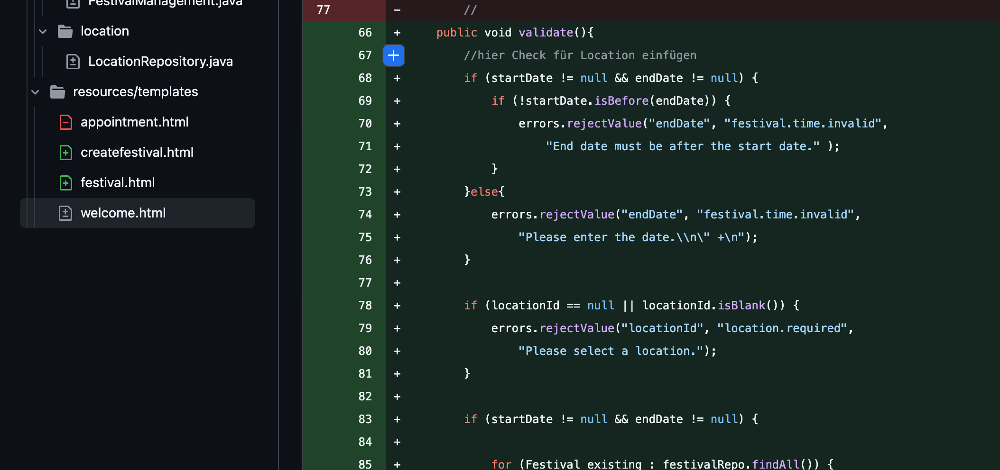
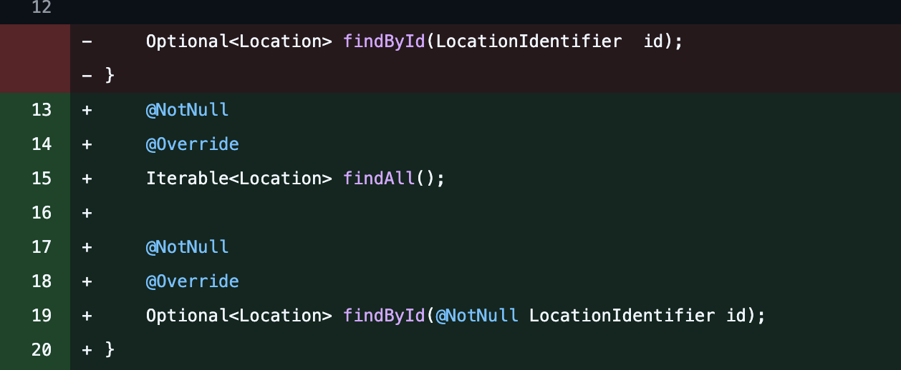

## 安全性相关

### 2.  在 Controller 中直接把 Entity 放进 model 是允许的

```java
Festival fest = festivalRepo.findById(id).orElseThrow();
model.addAttribute("festival", fest);
```

这段代码在 Spring MVC 中非常常见，用于在 HTML 页面显示实体内容。

本质上只是：

- 从数据库加载实体
- 放入 model
- Thymeleaf 读取并展示字段

不涉及**反序列化**、不涉及**外部输入**，就不会产生安全漏洞。

#### ❌ 若使用 Entity 来接收表单提交（反向绑定）不安全（见1）

这会导致 **Overbinding（过度绑定攻击）**
 攻击者能提交隐藏属性、覆盖本不该修改的字段，例如 ID、外键等。

 #### 最佳实践

若要严格遵守 MVC 与 DDD 分层，理想做法是：

- 页面显示：使用 DTO（如 FestivalView）
- 页面提交：使用 Form（如 FestivalForm）
- Entity 只在 Service 层使用，不直接暴露给 View

但这是“最佳实践”，不是必需条件。

------

 ✔ 不会导致安全漏洞，也不会引发运行时错误。

 ✔ 是否要改成 DTO，取决于你项目架构要求，不是安全问题。

### 3. 删除链接建议改为 **POST**（REST 风格 &安全性）

#### 前端

现在：

```html
<a th:href="@{/festival/delete/{id}(id=${festival.id.id})}">
    <button type="button">löschen</button>
</a>
```

使用 GET 做删除操作对于 Web 安全来说是不好的，因为：

- **用户刷新页面可能重复删除**
- **爬虫可能自动访问删除链接**

改为：

```html
<form th:action="@{/festival/delete/{id}(id=${festival.id.id})}" method="post">
    <button type="submit">löschen</button>
</form>
```


#### 后端

**把 Controller 中的删除方法改成 POST**

原来：

```java
@GetMapping("/festival/delete/{id}")
public String deleteFestival(@PathVariable("id") FestivalIdentifier id) {
    festivalRepo.deleteById(id);
    return "redirect:/festival";
}
```

------

##### ✅ 正确写法（改为 POST）：

```java
@PostMapping("/festival/delete/{id}")
public String deleteFestival(@PathVariable("id") FestivalIdentifier id) {
    festivalRepo.deleteById(id);
    return "redirect:/festival";
}
```

------


```java
 public void validate(Errors errors){
       //hier Check für Location einfügen
       if (startDate != null && endDate != null) {
          if (!startDate.isBefore(endDate)) {
             errors.rejectValue("endDate", "festival.time.invalid",
                "End date must be after the start date." );
          }
       }else{
          errors.rejectValue("endDate", "festival.time.invalid",
             "Please enter the date.");
       }

       if (locationId == null || locationId.isBlank()) {
          errors.rejectValue("locationId", "location.required",
             "Please select a location.");
       }

       if (startDate != null && endDate != null) {

          for (Festival existing : festivalRepo.findAll()) {

             FestivalForm location = new FestivalForm(
                existing.getName(),
                existing.getStartDate(),
                existing.getEndDate(),
                existing.getLocation().getLocationId()
             );
             
             if (!this.isNotConflicting(this, location)) {
                errors.rejectValue("startDate", "festival.conflict",
                   "The selected time conflicts with an existing festival at this location.");
                break;
             }
          }
       }
    }

//  public boolean isBefore(FestivalForm appointment) {
//     return appointment.getStartDate().isBefore(appointment.getEndDate());
//  } //Using `java.time`'s isBefore() directly. Custom method no longer needed.


    public boolean isNotConflicting(FestivalForm newFestival, FestivalForm location) {
       if (!Objects.equals(newFestival.getLocationId(), location.getLocationId())) {
          return false;
       }

       return newFestival.getEndDate().isBefore(location.getStartDate())
          ||newFestival.getStartDate().isAfter(location.getEndDate());
       // isBefore first used，and then
       //newFestival.getStartDate().isBefore(location.getStartDate()
       //return newFestival.getEndDate().isAfter(location.getEndDate()); are not necessary
    }
```


```java
Location findByName(String name);

@NotNull
@Override
Iterable<Location> findAll();

@NotNull
@Override
Optional<Location> findById(@NotNull LocationIdentifier id);
```




 

如果 Location.java 是：

```java
@Id
private UUID id;
```

则 Repository 必须写：

```java
public interface LocationRepository extends CrudRepository<Location, UUID> {
}
```

------


比如 Location 的 id 是 Long：

```java
private Long locationId;
```

如果 id 是 UUID：

```java
private UUID locationId;
```

------

## ⭐ 步骤 4：下拉框 value 必须输出正确的 id 类型

```html
<option th:each="loc : ${locations}"
        th:value="${loc.id}"
        th:text="${loc.name}">
</option>
```

------

## ⭐ 步骤 5：FestivalManagement.createFestival 使用真正的主键类型查找

例如主键是 Long：

```java
Location location = locationRepository.findById(form.getLocationId())
    .orElseThrow(() -> new IllegalArgumentException("Invalid location id"));
```

如果主键是 UUID：

```java
Location location = locationRepository.findById(form.getLocationId())
    .orElseThrow(() -> new IllegalArgumentException("Invalid location id"));
```

