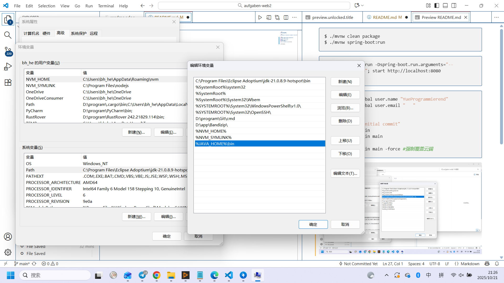
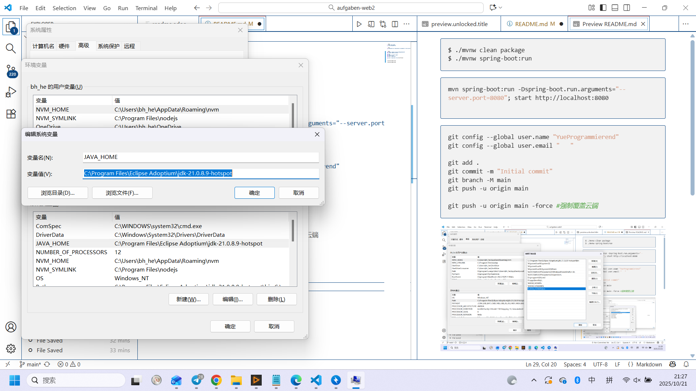

## Woche 1


```bash
$ ./mvnw clean package
$ ./mvnw spring-boot:run
```

```bash
mvn spring-boot:run -Dspring-boot.run.arguments="--server.port=8080"; start http://localhost:8080

```

```bash
git config --global user.name "YueProgrammierend"
git config --global user.email "   "

git add .
git commit -m "Initial commit"
git branch -M main
git push -u origin main

git push -u origin main -force #强制覆盖云端
```






| 没有网关                             | 有网关       |
| -------------------------------- | --------- |
| 用户必须记住每个服务地址（如 `:8081`, `:8082`） | 用户只访问一个域名 |
| 每个服务都要处理鉴权、跨域、日志                 | 网关统一处理    |
| 系统扩展时需要修改很多客户端配置                 | 只改网关路由即可  |


### 🧩  [https://start.spring.io/](https://start.spring.io/) 在线生成基于该脚手架的项目
#### Spring Boot ↑
#### Spring Framework
#### Spring Data JPA
#### Thymeleaf
#### Semantic UI and Bootstrap
#### HTMX


## Woche 2

- [x] <mark>新建`SearchCatalog.java`</mark>= /导入已有
    - [ ] 导入搜索、分类
    - [ ]  用到了什么Struct？  
- [ ] `navagation.html`（可能需要修改）
- [ ] 是否需要修改其他java、html？


| 注解                | 请求方法   | 作用                              |
| ----------------- | ------ | ------------------------------- |
| `@GetMapping`     | GET    | 从服务器获取资源（浏览、查询）                 |
| `@PostMapping`    | POST   | 向服务器提交数据（表单、创建对象）               |
| `@PutMapping`     | PUT    | 更新资源（整体替换）                      |
| `@PatchMapping`   | PATCH  | 局部更新资源                          |
| `@DeleteMapping`  | DELETE | 删除资源                            |
| `@RequestMapping` | 任意方法   | 上面这些的“通用父类”，可以指定 method 参数      |
| `@PathVariable`   | -      | 把 URL 里的 `{变量}` 部分绑定到方法参数       |
| `@RequestParam`   | -      | 把 URL 查询参数 `?key=value` 绑定到方法参数 |
| `@RequestBody`    | -      | 从请求体里读取 JSON/XML 并自动反序列化为对象     |

### [filters](https://docs.spring.io/spring-framework/reference/web/webmvc/filters.html)
