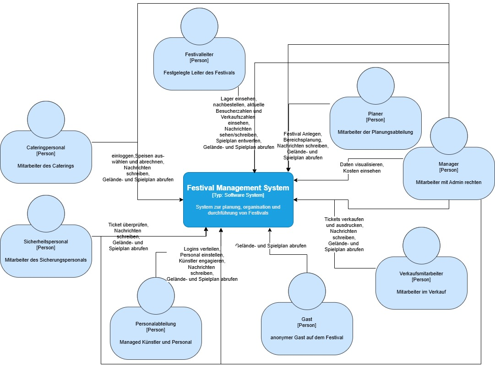
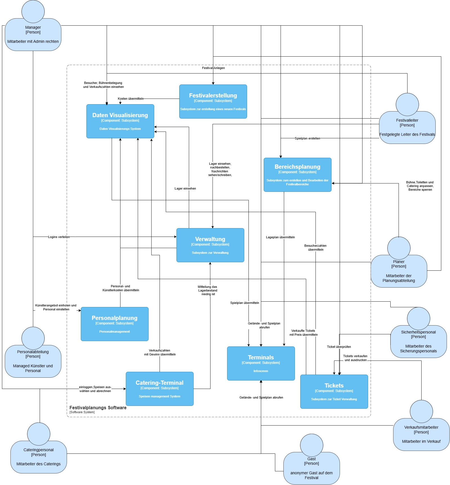
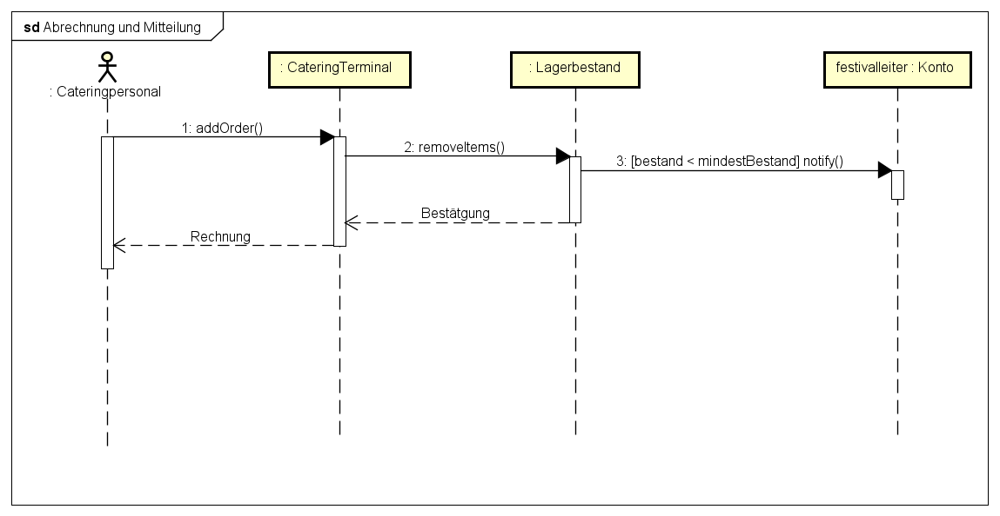
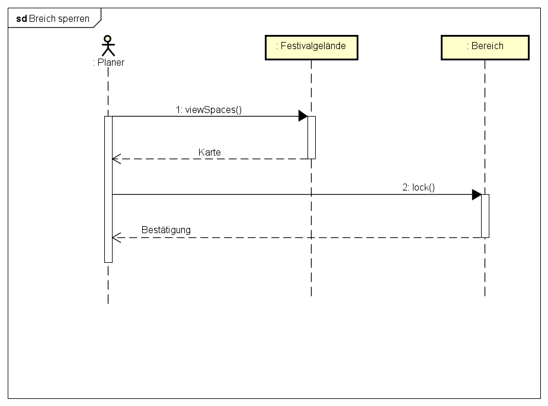
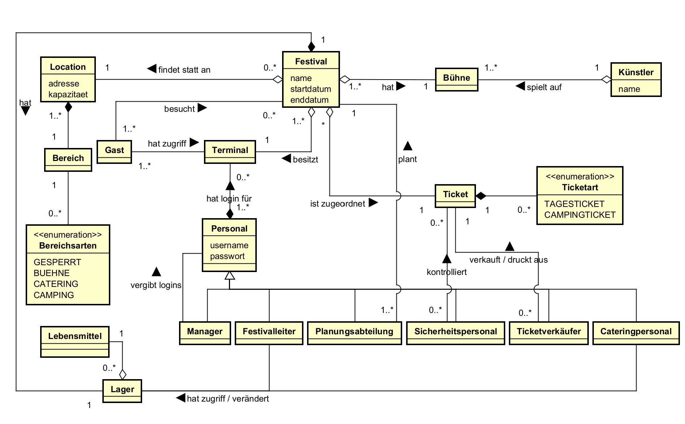

:project_name: Festivalmanager
:toc: left
:numbered:
= Pflichtenheft __{project_name}__

[options="header"]
[cols="1, 1, 1, 1, 4"]
|===
|Version | Status      | Bearbeitungsdatum   | Autoren(en) |  Vermerk
|0.1     | In Arbeit   | 10.10.2021          | Autor       | Initiale Version
|===

== Inhaltsverzeichnis
Dieses Dokument benötigt ein Inhaltsverzeichnis. Es existieren mehrere Einbindungsmöglichkeiten.

== Zusammenfassung
Eine kurze Beschreibung des Dokuments. Wenige Absätze.

== Aufgabenstellung und Zielsetzung

Die FVIV GmbH plant die Einführung eines neuen IT-Systems, da das bisherige System den steigenden Anforderungen der Festivalorganisation nicht mehr gerecht wird. Das neue System soll sowohl interne Verwaltungsprozesse organisieren als auch den Kontakt mit Kunden regeln.

Zunächst werden für jedes Festival der Termin und die Location festgelegt. Dabei ist sicherzustellen, dass keine Location doppelt gebucht wird. Jede Location verfügt über eine maximale Besucherzahl, eine Höchstanzahl zulässiger Bühnen und eine feste Unterteilung in eindeutig gekennzeichnete Bereiche, die wiederum unterschiedlichen Typen wie Camping, Parken, Catering oder Bühne zugeordnet sind. Um der Planungsabteilung eine klare Orientierung zu ermöglichen, müssen das Gelände und seine Bereiche visuell dargestellt werden. Die Visualisierung wird über einen 2 dimensionalen Lageplan realisiert. Bereiche sollen bei Bedarf gesperrt werden und die jeweiligen Koordinaten können angepasst werden.

Ein weiterer zentraler Bestandteil des Systems ist die Verwaltung der Künstler und der Aufbau des Festivalprogramms. Angebote von Künstlern werden erfasst und im System für andere festivals wiederverwendbar gespeichert. Der Festivalleiter erstellt anschließend den Spielplan und legt die Auftrittszeiten fest. Zusätzlich muss das Personal auf das Festival eingeteilt werden. Dazu gehören: Sicherheitskräfte,  Cateringpersonal, Bühnentechniker sowie der Festivalleiter selbst, der bereits während der Planung zugeordnet werden muss. Da alle Arbeitskräfte  bezahlt werden, muss dieser Aspekt in der Kostenaufstellung berücksichtigt werden.

Sobald ein Festival freigegeben ist, wird der Ticketpreis festgelegt. Es gibt Camping-Tickets und Tageskarten für das Festival. Diese Tickets werden bis drei Tage vor Beginn ausschließlich in den Filialen der FVIV GmbH verkauft, danach nur noch an der Kasse vor Ort. Das System muss Verkaufsmitarbeitern ermöglichen, Tickets auszugeben, auszudrucken und als PDF bereitzustellen. Jedes Ticket enthält entweder einen Barcode oder eine eindeutige Nummer, sodass das Sicherheitspersonal am Eingang die Gültigkeit überprüfen und mehrfach Nutzung verhindern kann.

Für das Cateringpersonal stehen eigene Terminals bereit, an denen sie sich mit einem gültigen Login anmelden können. Dort wählen sie Speisen und Getränke aus, rechnen Verkäufe ab und verringern automatisch den Lagerbestand. Sinkt der Bestand unter einen bestimmten Mindestwert, wird automatisch eine Nachricht an die Festivalleitung gesendet. Der Festivalleiter kann Lagerbestände einsehen, Bestellungen tätigen, aktuelle Besucherzahlen abrufen und die Bühnenbelegung sowie Verkaufszahlen überwachen kann. Auch Nachrichten anderer Mitarbeitender werden dort angezeigt.

Über das gesamte Festivalgelände verteilt gibt es weitere Terminals, die für Besucher frei zugänglich sind. Diese zeigen einen Plan des Geländes sowie den kompletten Spielplan der Festivaltage an, ohne dass dafür eine Anmeldung erforderlich ist.

Eine besondere Rolle nimmt der Manager der FVIV GmbH ein, der Administrator des Systems ist und Zugriff auf sämtliche Funktionen besitzt. Er ist für die Personalverwaltung zuständig, erstellt und verwaltet Mitarbeiterzugänge, vergibt Berechtigungen und kann sowohl betriebswirtschaftliche Daten eines einzelnen Festivals als auch die Gesamtbilanz einsehen. Außerdem hat er Zugriff auf alle Funktionen des Systems.

Während der gesamten Planungsphase muss eine automatisch aktualisierte Kostenaufstellung verfügbar sein. Diese umfasst Mietkosten, Künstlergagen, Personalkosten sowie sonstige Ausgaben. Die Darstellung kann tabellarisch erfolgen und kann optional durch eine Darstelllung durch einen Graphen ergänzt werden.

Die interne Kommunikation erfolgt über einen gemeinsamen Chatkanal. Nachrichten können von allen Mitarbeitenden gesendet und von allen eingesehen werden. Privatnachrichten sind möglich, jedoch auch von allen einsehbar.

Ziele des Projekts:

* Effiziente Planung von Festivals (inkl. Location, Bühnen, Personal)
* Übersichtliche Kostenaufstellung in Echtzeit
* Unterstützung während des Festivals (Catering, Sicherheit, Bühnenmanagement)
* Darstellung von Lageplan und Spielplan für Besucher

== Produktnutzung

Das Produkt soll der FVIV Gmbh zur Verfügung stehen um ihre Festivals zu organisieren. Dabei wird das Festival der Kunden, der FVIV Gmbh, durch die FVIV Gmbh geplant und die Location zur Verfügung gestellt, welche durch die Software verwaltet werden kann.

Dabei soll die Anwendungen auf folgenden Browsern verfügbar sein:

* Chrome v. 114.0.5735.90 +
* Firefox v. 145 +

Hauptnutzer der Software wird die FVIV Gmbh, die sie folgendermaßen nutzen können:
as System wird von der FVIV GmbH zur Planung und Durchführung von Festivals eingesetzt.  
Es dient:

* der Erstellung und Verwaltung von Festivals
* der Überwachung von Personal, Kosten und Bühnenbelegung
* dem abrechnen von Speisen und Getränken
* der Zugangskontrolle
* zur Einsicht des Spielplans und Festivalgeländes

== Interessensgruppen (Stakeholders)
Die Interessensgruppen sind eine Auflistung von Personen, welche einen Einfluss auf die Anforderungen des Systems haben.
In der unten aufgeführten Tabelle sind alle Interessensgruppen und deren Ziele, sowie Prioritäten aufgelistet und beschrieben.

[options="header"]
[cols="2, ^1, 4, 4"]
|===
|Name
|Priorität
|Beschreibung
|Ziele

|Entwickler
|3 
|Personen die entweder das Programm implementieren oder später für dessen Wartung verantwortlich sind.
a|
* gute deugging Mechanismen
* leicht erweiterbares Programm
* geringe Instandhaltungsarbeit

|Manager 
|5 
|Mitarbeiter, welcher die Personalverantwortung trägt und die Wirtschaftlichkeit, als auch das Festival an sich als Veranstalter überwacht. Der Primäre Klient dieses Projekts.
a| 
* mehr Festivals veranstalten 
* Automatisieren von Prozessen

|Planungsabteilung
|4
|Repräsentiert alle Mitarbeiter, welche an der Planung eines Festivals teilnehmen.
a|
* einfaches Erstellen und Bearbeiten eines Festivals und dessen Aspekte

|Festivalleiter 
|4 |Repräsentiert ein Kooperator, der die Organisation des Festivals übernimmt. 
a|
* Erhalten einer Lagerübersicht 
* einfache Übersicht über Festivaldetails 
* mehr Festivaltickets verkaufen

|Sicherheitspersonal
|2
|Repräsentiert Mitarbeiter, der für Sicherheit am Festivalgelände zuständig ist. 
a| 
* einfaches Überprüfen der Gültigkeit von Tickets

|Verkaufsmitarbeiter 
|3 
|Repräsentiert Mitarbeiter, der für den Ticketverkauf zuständig ist. 
a|
* verständliche Ticketansicht
* leichtes Ausdrucken von Tickets

|Cateringpersonal 
|3 
|Repräsentiert Mitarbeiter, welcher in den Cateringständen tätig ist. 
a| 
* einfaches Abrechnen von Speisen

|Gast
|1 
|Repräsentiert einen Besucher des Festivals. 
a| 
* gutes Nutzererlebnis 
* leicht verständlicher Spiel- und Lageplan
|===

== Systemgrenze und Top-Level-Architektur

=== Kontextdiagramm
Das Kontextdiagramm zeigt das geplante Software-System in seiner Umgebung.

=== Top-Level-Architektur

== Anwendungsfälle

=== Akteure

Akteure sind die Benutzer des Software-Systems oder Nachbarsysteme, welche darauf zugreifen. Diese Tabelle gibt einen Überblick über die Akteure und beschreibt sie kurz.

// See http://asciidoctor.org/docs/user-manual/#tables
[options="header"]
[cols="1,4"]
|===
|Name |Beschreibung
|Manager |Mitarbeiter, welcher die Personalverantwortung trägt und die Wirtschaftlichkeit, als auch das Festival an sich als Veranstalter überwacht.
|Planungsabteilung (Planer) |Repräsentiert alle Mitarbeiter, welche an der Planung eines Festivals teilnehmen.
|Festivalleiter |Repräsentiert einen Kooperator, der die Organisation des Festivals übernimmt.
|Sicherheitspersonal |Repräsentiert Mitarbeiter, der für Sicherheit am Festivalgelände zuständig ist.
|Verkaufsmitarbeiter |Repräsentiert Mitarbeiter, der für den Ticketverkauf zuständig ist.
|Cateringpersonal |Repräsentiert Mitarbeiter, welcher in den Cateringständen tätig ist.
|Gast |Repräsentiert einen Besucher des Festivals.
|===

=== Überblick Anwendungsfalldiagramm
Anwendungsfall-Diagramm, das alle Anwendungsfälle und alle Akteure darstellt

image::./models/analysis/Anwendungsfalldiagramm.jpeg[Use Case Diagram, 100%, 100%, pdfwidth=100%, title= "Anwendungsfalldiagramm des {project_name}", align=center]

=== Anwendungsfallbeschreibungen

[cols="1h,3"]
|===
|ID                             |**<<UC0010>>**
|Name                           |Lagerbestände Einsehen
|Beschreibung                   |Aktuelle MEngen an Lebensmitteln und Getränken im Lager können eingesehen werden.
|Akteure                        |Festivalleiter, Cateringpersonal
|Trigger                        |Lagerbestand soll überprüft werden
|Vorraussetzung(en)             a|
                                -   Initialer Lagerbestand ist im System vorhanden
                                -   Festivalleiter/Cateringpersonal ist eingeloggt
                                -   Lagerbestände wurden aktualisiert
|Essentielle Schritte           a|
                                1.  Das Lager wird im System aufgerufen
                                2.  Der aktuelle Bestand wird angezeigt
|Erweiterungen                  a|
|Funktionale Anforderungen      | <<F0910>>, <<F1000>>, <<F1010>>, <<F1020>>, <<F1100>>
|===
[cols="1h,3"]
|===
|ID                             |**<<UC0011>>**
|Name                           |Speisen auswählen und abrechnen
|Beschreibung                   |Catering nimmt die Bestellungen der Kunden entgegen und trägt diese im System ein.
|Akteure                        |Cateringpersonal
|Trigger                        |Kunden gibt eine Bestellung ab
|Vorraussetzung(en)             a|
                                -   Cateringpersonal vorhanden und eingeloggt
                                -   Kundenwunsch vorhanden
|Essentielle Schritte           a|
                                1.  Catering eingeloggt
                                2.  Eingabe der Bestellung
                                3.  Bestätigung der Bestellung und Bezahlung
|Erweiterungen                  a|
|Funktionale Anforderungen      | <<F0900>>, <<F0910>>
|===

[cols="1h,3"]
|===
|ID                             |**<<UC0012>>**
|Name                           |vom Lagerbestand abziehen
|Beschreibung                   |Nach einer Bestellung eines Kunden wird die Menge intern vom Lagerbestand abgezogen.
|Akteure                        |Cateringpersonal (indirekt)
|Trigger                        |bestätigte Bestellung geht ein
|Vorraussetzung(en)             a|
                                -   Cateringpersonal vorhanden
                                -   Bestellung erfüllbar
|Essentielle Schritte           a|
                                1.  Catering eingeloggt
                                2.  Eingabe der Bestellung
                                3.  Bestätigung der Bestellung und Bezahlung
                                4.  interne Übermittlung der Daten
                                5.  Aktualiserung des Bestands
|Erweiterungen                  a|
|Funktionale Anforderungen      | <<F1000>>
|===

[[sd_Abrechnung_und_Mitteilung]]

[cols="1h,3"]
|===
|ID                             |**<<UC0013>>**
|Name                           |Mitteilung an Festivalleitung
|Beschreibung                   |Bei Unterschreitung des Mindestbestands wird intern eine Mitteilung an die Festivalleitung gesendet.
|Akteure                        |System
|Trigger                        |Mindestbestand unterschritten
|Vorraussetzung(en)             a|
|Essentielle Schritte           a|
                                1.  System prüft aktuellen Bestand
                                2.  Erkennung einer Unterschreitung
                                3.  System gibt eine Nachricht an den Account des Festivalleiters
|Erweiterungen                  a|
|Funktionale Anforderungen      | <<F1020>>
|===

[cols="1h,3"]
|===
|ID                             |**<<UC0110>>**
|Name                           |Nachbestätigungen tätigen
|Beschreibung                   |Der Festivalleiter kann einzelne Produkte nachbestellen.
|Akteure                        |Festivalleiter
|Trigger                        |Mindestbestand unterschritten oder Festivalleiter möchte nachbestellen
|Vorraussetzung(en)             a| Lagerbestand ist im System vorhanden
|Essentielle Schritte           a|
                                1.  Überprüfung des Lagerbestands
                                2.  Auswahl der nachzubestellenden Produkte
                                3.  Bestätigung der Bestellung
|Erweiterungen                  a|
|Funktionale Anforderungen      | <<F0200>>, <<F1000>>, <<F1010>>
|===

[cols="1h,3"]
|===
|ID                             |**<<UC0200>>**
|Name                           |betriebswirtschaftliche Daten grafisch visualisieren
|Beschreibung                   |Es soll möglich sein, Daten wie Budget, Umsatz und Ausgaben visuell für den Abrufenden darzustellen.
|Akteure                        |Manager
|Trigger                        |Manager möchte Daten betrachten
|Vorraussetzung(en)             a|
                                -   Daten bereits im System vorhanden
|Essentielle Schritte           a|
                                1.  Manager im System eingeloggt
                                2.  Aufrufen der Datenvisulisierung
|Erweiterungen                  a|
|Funktionale Anforderungen      | <<F0700>>, <<F0703>>, <<F0701>>, <<F0702>>, <<F1100>>
|===

[cols="1h,3"]
|===
|ID                             |**<<UC0210>>**
|Name                           |Kostenaufstellung einsehen
|Beschreibung                   |Um wichtige Entscheidungen zu treffen, müssen Befugte die Kostenaufstellung des Festivals einsehen.
|Akteure                        |Manager
|Trigger                        |
|Vorraussetzung(en)             a|
                                -   Daten bereits im System vorhanden
|Essentielle Schritte           a|
                                1.  Befugte im System eingeloggt
                                2.  Aufruf des Reiters Kostenaufstellung
                                3.  Berechnung und Darstellung der Information
|Erweiterungen                  a|
|Funktionale Anforderungen      | <<F0700>>, <<F0703>>, <<F0701>>, <<F0702>>, <<F1100>>
|===

[cols="1h,3"]
|===
|ID                             |**<<UC0220>>**
|Name                           |Aktuelle Bühnenbelegung einsehen
|Beschreibung                   |Aktuelle Bühnenbelegung kann eingesehen werden.
|Akteure                        |Festivalleiter, Manager
|Trigger                        |Festivalleiter/Manager möchte Bühnenbelegung überprüfen
|Vorraussetzung(en)             a|
                                
                                -   aktuelle Bühnenbelegung ist im System vorhanden
                                -   Festivalleiter/Manager ist eingeloggt
|Essentielle Schritte           a|
                                
                                1.  Festivalleiter/Manager loggt sich ein
                                2.  Festivalleiter/Manager ruft Bühnenbelegung auf
|Erweiterungen                  a|
|Funktionale Anforderungen      | <<F1100>>
|===

[cols="1h,3"]
|===
|ID                             |**<<UC0230>>**
|Name                           |Aktuelle Besucherzahlen einsehen
|Beschreibung                   |aktuelle Besucherzahlen können eingesehen werden
|Akteure                        |Festivalleiter, Manager
|Trigger                        |Leitung möchte Besucherzahlen überprüfen
|Vorraussetzung(en)             a|
                                
                                -   aktuelle Besucherzahlen sind im System vorhanden
                                -   Festivalleiter/Manager ist eingeloggt
|Essentielle Schritte           a|
                                
                                1.  Festivalleiter/Manager loggt sich ein
                                2.  Festivalleiter/Manager ruft Besucherzahlen auf
|Erweiterungen                  a|
|Funktionale Anforderungen      | <<F100>>
|===

[cols="1h,3"]

|===
|ID                             |**<<UC0240>>**
|Name                           |Verkaufszahlen des Caterings einsehen
|Beschreibung                   |Verkaufszahlen des Caterings können eingesehen werden.
|Akteure                        |Festivalleiter, Manager
|Trigger                        |Festivalleiter/Manager möchte Verkaufszahlen überprüfen
|Vorraussetzung(en)             a|
                                
                                -   aktuelle Verkaufszahlen sind im System vorhanden
                                -   Festivalleiter/Manager ist eingeloggt
|Essentielle Schritte           a|
                                
                                1.  Festivalleiter/Manager loggt sich ein
                                2.  Festivalleiter/Manager ruft Verkaufszahlen auf
|Erweiterungen                  a|
|Funktionale Anforderungen      | <<F1100>>
|===

[cols="1h,3"]
|===
|ID                             |**<<UC0300>>**
|Name                           |Ticket auf Gültigkeit prüfen 
|Beschreibung                   |Sicherheitspersonal checkt Tickets der Besucher
|Akteure                        |Sicherheitspersonal, (Gast)
|Trigger                        |Veranstalter möchte, dass nur Gäste mit gültigem Ticket das Festival besuchen
|Vorraussetzung(en)             a|
                                
                                -   Eindeutige Tickets
                                -   Vorheriger Verkauf

|Essentielle Schritte           a|
                                
                                1.  Ticket wird erworben und Nachweis bereitgestellt
                                2.  Ticket wird auf Gültigkeit Überprüft

|Erweiterungen                  a|
|Funktionale Anforderungen      | <<F0820>>
|===

[[sd_Ticket_pruefen]]
image::./models/analysis/sd_Ticketkontrolle.png[Sequenzdiagramm: Ticket prüfen, 60%, 60%, pdfwidth=50%, title= "Sequenzdiagramm: Ticket kontrolieren", align=center]

[cols="1h,3"]
|===
|ID                             |**<<UC0310>>**
|Name                           |Ticket verkaufen
|Beschreibung                   |Verkaufsmitarbeiter verkauft Ticket an Gast
|Akteure                        |Verkaufsmitarbeiter, Gast
|Trigger                        |Gast möchte Zugang zum Festival
|Vorraussetzung(en)             a|
                                -   eindeutige Tickets
                                -   Tickets lassen sich überprüfen
|Essentielle Schritte           a|
                                
                                1.  Gast geht zu Verkaufsmitarbeiter
                                2.  Mitarbeiter erstellt Ticket für Gast
                                3.  Gast bezahlt und geht
|Erweiterungen                  a|
|Funktionale Anforderungen      | <<F0200>>, <<F0800>>
|===

[cols="1h,3"]
|===
|ID                             |**<<UC0311>>**
|Name                           |Ticket ausdrucken
|Beschreibung                   |Verkaufsmitarbeiter druckt Ticket
|Akteure                        |Verkaufsmitarbeiter
|Trigger                        |Gast möchte zugang zum Festival
|Vorraussetzung(en)             a|
                                
                                -   Eindeutige Tickets
                                -   Tickets lassen sich überprüfen
|Essentielle Schritte           a|
                                
                                1.  Verkaufsmitarbeiter erstellt Ticket für Gast
                                2.  Verkaufsmitarbeiter druckt Ticket aus
|Erweiterungen                  a|
|Funktionale Anforderungen      | <<F0200>>, <<F0800>>, <<F0810>>
|===

[cols="1h,3"]
|===
|ID                             |**<<UC0312>>**
|Name                           |Tickets vom Bestand abziehen
|Beschreibung                   |Beim Verkauf eines Tickets wird dieses automatisch vom Bestand abgezogen.
|Akteure                        |Verkaufsmitarbeiter
|Trigger                        |Gast möchte Zugang zum Festival
|Vorraussetzung(en)             a|
                                -   Eindeutige Tickets
                                -   Tickets lassen sich überprüfen
|Essentielle Schritte           a|
                                1.  Ticket wird erstellt
                                2.  Ticket wird aus dem Bestand abgezogen
                                3.  Ticket wird verkauftem Bestand hinzugefügt
|Erweiterungen                  a|
|Funktionale Anforderungen      | <<F0200>>, <<F0800>>
|===

[[sd_Festival_anlegen]]
image::./models/analysis/sd_Festival_anlegen.png[Sequenzdiagramm: Festival anlegen, 60%, 60%, pdfwidth=50%, title= "Sequenzdiagramm: Festival anlegen", align=center]

[cols="1h,3"]
|===
|ID                             |**<<UC400>>**
|Name                           |Festival anlegen
|Beschreibung                   |Ein neues Festival wird im System aufgenommen.
|Akteure                        |Planungsabteilung
|Trigger                        |Erstmalige Planungsentscheidung getroffen
|Vorraussetzung(en)             a|
                                -   Planungsabteilung erhält Zugriff zum System
|Essentielle Schritte           a|
                                1.  Planer legen sich fest
                                2.  Planer erstellen ein neues Festival im System
|Erweiterungen                  a|
                                -   Es folgen die notwendigen Informationen in den folgenden Anwendungsfällen
|Funktionale Anforderungen      | <<F0000>>
|===

[cols="1h,3"]
|===
|ID                             |**<<UC0401>>**
|Name                           |Termin festlegen
|Beschreibung                   |Für das neue Festival muss ein Termin angesetzt werden.
|Akteure                        |Planungsabteilung
|Trigger                        |Festival wird im System angelegt
|Vorraussetzung(en)             a|
|Essentielle Schritte           a|
                                1.  Eingabe des gewünschten Termins
                                2.  Bestätigung des Termins
|Erweiterungen                  a|
|Funktionale Anforderungen      | <<F0000>>
|===

[cols="1h,3"]
|===
|ID                             |**<<UC0402>>**
|Name                           |Location buchen
|Beschreibung                   |Für das neue Festival wird eine Location gebucht.
|Akteure                        |Planungsabteilung
|Trigger                        |Festival wird im System angelegt
|Vorraussetzung(en)             a|
|Essentielle Schritte           a|
                                1.  Eingabe des gewünschten Termins
                                2.  Bestätigung des Termins
|Erweiterungen                  a|
|Funktionale Anforderungen      | <<F0000>>
|===

[cols="1h,3"]
|===
|ID                             |**<<UC0403>>**
|Name                           |Festivalleiter zuordnen
|Beschreibung                   |Für das neue Festival muss ein Leiter zugeteilt werden.
|Akteure                        |Planungsabteilung
|Trigger                        |Festival wird im System angelegt
|Vorraussetzung(en)             a|
                                -   mögliche Personen sind bekannt
|Essentielle Schritte           a|
                                1.  mögliche Personen werden eingesehen
                                2.  Auswahl einer Person
                                3.  ausgewählte Person bekommt Titel und Zugangsrechte
|Erweiterungen                  a|
|Funktionale Anforderungen      | <<F0300>>
|===

[cols="1h,3"]
|===
|ID                             |**<<UC0410>>**
|Name                           |Festivalplanung abschließen
|Beschreibung                   |Bei Abschluss der Planung werden Teile das Festival für weitere Änderungen gesperrt.
|Akteure                        |Planungsabteilung, Manager
|Trigger                        |Planung ist abgeschlossen
|Vorraussetzung(en)             a| 
                                -   Infos für Planung sind vollständig im System vorhanden
                                -   Übergange zwischen Planung und Durchführung sind definiert
                                -   Logins sind verteilt
|Essentielle Schritte           a|
                                1.  Planung wird abgeschlossen
                                2.  Festival wird für Änderungen gesperrt
                                3.  Festival wird für Durchführung freigegeben
|Erweiterungen                  a|
|Funktionale Anforderungen      | <<F0010>>, <<F0200>>, <<F0300>>
|===

[cols="1h,3"]

|===
|ID                             |**<<UC0420>>**
|Name                           |Festival bearbeiten
|Beschreibung                   |Teile des Festival werden bearbeitet.
|Akteure                        |Festivalleiter, Planungsabteilung
|Trigger                        |Änderungen in der Planung sind notwendig
|Vorraussetzung(en)             a|
|Essentielle Schritte           a|

                                1.  Aktuelle Informationen werden eingesehen
                                2.  Änderungen werden vorgenommen
                                3.  Änderungen werden bestätigt und gespeichert
|Erweiterungen                  a|
|Funktionale Anforderungen      | <<F0010>>, <<F0200>>, <<F0410>>, <<F0610>>
|===

[cols="1h,3"]
|===
|ID                             |**<<UC0500>>**
|Name                           |Festivalgeländeplan einsehen
|Beschreibung                   |Gast sieht sich Informationen zum Festival an
|Akteure                        |Gast
|Trigger                        |Gast möchte Informationen zum Festival
|Vorraussetzung(en)             a|
                                
                                -   Terminal für Gast verfügbar
|Essentielle Schritte           a|
                                
                                1.  Planungsdaten sind vorhanden
                                2.  Besucher hat Zugang zu Terminal
                                3.  Daten können angezeigt werden
|Erweiterungen                  a|
|Funktionale Anforderungen      | <<F0100>>, <<F0400>>
|===

[cols="1h,3"]
|===
|ID                             |**<<UC0510>>**
|Name                           |Spielplan einsehen
|Beschreibung                   |Person möchte Spielplan erfahren.
|Akteure                        |Gast
|Trigger                        |Gast möchte Informationen zum Festival
|Vorraussetzung(en)             a|
                                -   Planungsdaten sind vorhanden
|Essentielle Schritte           a|
                                1.Gast lässt sich den Spielplan anzeigen
|Erweiterungen                  a|
|Funktionale Anforderungen      | <<F0100>>, <<F0600>>
|===

[cols="1h,3"]
|===
|ID                             |**<<UC0520>>**
|Name                           |Einloggen
|Beschreibung                   |Person braucht Zugang zu ihrem Konto
|Akteure                        |Sicherheitspersonal, Verkaufsmitarbeiter, Personalabteilung, Planer, Festivalleiter, Caterinpersonal
|Trigger                        |Festivalleiter muss Festivalablauf organisieren
|Vorraussetzung(en)             a|
                                
                                -   Festival findet statt
                                -   Logindaten sind vorhanden
|Essentielle Schritte           a|
                                
                                1.  Festivalleiter wird Festival zugeteilt
                                2.  Fetivalleiter erhält Daten
                                3.  Einloggen mit gegebenen Daten
|Erweiterungen                  a|
|Funktionale Anforderungen      | <<F0100>>, <<F0200>>
|===

[[sd_Bereich_sperren]]

[cols="1h,3"]
|===
|ID                             |**<<UC0600>>**
|Name                           |Bereich sperren
|Beschreibung                   |Ein Bereich des Geländes wird für Gäste gesperrt.
|Akteure                        |Planungsabteilung
|Trigger                        |Bereich soll unzugänglich gemacht werden.
|Vorraussetzung(en)             a|
                                -   Festival angelegt mit Location und Termin
                                -   eine Übersicht der Location ist vorhanden
|Essentielle Schritte           a|
                                1.  Übersicht wird geöffnet
                                2.  betroffener Bereich wird ausgewählt
|Erweiterungen                  a|
|Funktionale Anforderungen      | <F<0400>>, <<F0410>>, <<F0420>>
|===

[cols="1h,3"]
|===
|ID                             |**<<UC0610>>**
|Name                           |Bühnen mieten
|Beschreibung                   |Bühnen müssen beschafft werden
|Akteure                        |Planungsabteilung
|Trigger                        |
|Vorraussetzung(en)             a|
                                -   Festival angelegt mit Location und Termin
|Essentielle Schritte           a|
                                1.  Auswahl der benötigten Bühnen
                                2.  Bestätigung der Auswahl

|Erweiterungen                  a|
|Funktionale Anforderungen      | <<F0400>> <<F0410>>
|===

[cols="1h,3"]
|===
|ID                             |**<<UC0611>>**
|Name                           |Bühnenpositionierung anpassen
|Beschreibung                   |Die Abgrenzungen eines Bereichs werden geändert.
|Akteure                        |Planungsabteilung
|Trigger                        |
|Vorraussetzung(en)             a|
                                -   Festival angelegt mit Location und Termin
|Essentielle Schritte           a|
                                1.  Auswählen des betroffenen Bereichs
                                2.  Editierung des Bereichs

|Erweiterungen                  a|
|Funktionale Anforderungen      | <<F0400>> <<F0410>>
|===

[cols="1h,3"]
|===
|ID                             |**<<UC0620>>**
|Name                           |Cateringstände mieten
|Beschreibung                   |Cateringstände müssen von externen Unternehmen beschaffen werden.
|Akteure                        |Planungsabteilung
|Trigger                        |Bereichsplanung
|Vorraussetzung(en)             a|
                                -   Festival angelegt mit Location und Termin
                                -   eine Übersicht der Location ist vorhanden
|Essentielle Schritte           a|
                                1.  Auswahl der benötigten Stände
                                2.  Bestätigung der Auswahl
|Funktionale Anforderungen      | <<F0400>>, <<F0410>>
|===

[cols="1h,3"]
|===
|ID                             |**<<UC0621>>**
|Name                           |Cateringstände platzieren
|Beschreibung                   |Positionen der benötigten Stände für das Catering der Besucher werden festgelegt.
|Akteure                        |Planungsabteilung
|Trigger                        |Bereichsplanung
|Vorraussetzung(en)             a|
                                -   Festival angelegt mit Location und Termin
                                -   eine Übersicht der Location ist vorhanden
|Essentielle Schritte           a|
                                1.  Übersicht des Bereichs wird aufgerufen
                                2.  Platzierung der Marker auf Übersicht
|Erweiterungen                  a|
|Funktionale Anforderungen      | <<F0400>>, <<F0410>>
|===

[cols="1h,3"]
|===
|ID                             |**<<UC0630>>**
|Name                           |Toiletten mieten
|Beschreibung                   |Toieletten müssen von externen Unternehmen beschaffen werden
|Akteure                        |Planungsabteilung
|Trigger                        |Bereichsplanung
|Vorraussetzung(en)             a|
                                -   Festival angelegt mit Location und Termin
|Essentielle Schritte           a|
                                1.  Auswahl der benötigten Toiletten
                                2.  Bestätigung der Auswahl
|Erweiterungen                  a|
|Funktionale Anforderungen      | 
|===

[cols="1h,3"]
|===
|ID                             |**<<UC0631>>**
|Name                           |Toilettenbestückung anpassen
|Beschreibung                   |Positionen der benötigten Toiletten auf dem Gelände.
|Akteure                        |Planungsabteilung
|Trigger                        |Bereichsplanung
|Vorraussetzung(en)             a|
                                -   Festival angelegt mit Location und Termin
                                -   eine Übersicht der Location ist vorhanden
|Essentielle Schritte           a|
                                1.  Übersicht des Bereichs wird aufgerufen
                                2.  Platzierung des Markers
|Erweiterungen                  a|
|Funktionale Anforderungen      | <<F0400>>, <<F0410>>
|===

[cols="1h,3"]
|===
|ID                             |**<<UC0700>>**
|Name                           |Künstlerangebot einholen
|Beschreibung                   |Es werden die Angebote von verschiedenen Künstlern herangebracht.
|Akteure                        |Personalabteilung
|Trigger                        |Planer muss Line-up zusammenstellen
|Vorraussetzung(en)             a|Festival angelegt mit Location und Termin
|Essentielle Schritte           a|
                                1.  Planer kontaktiert Künstler
                                2.  Künstler geben ihre Angebote
                                3.  Planer setzt die Angebote auf eine Liste
|Erweiterungen                  a|
                                -   Berücksichtigung der Gagen verschiedener Künstler
|Funktionale Anforderungen      | <<F0500>>
|===

[cols="1h,3"]
|===
|ID                             |**<<UC0701>>**
|Name                           |Künstler auswählen
|Beschreibung                   |Aus verfügbaren Künstlern nach der Angebotsbeschaffung werden
einige ausgewählt.
|Akteure                        |Personalabteilung
|Trigger                        |Planer sucht die geeigneten Künstler heraus.
|Vorraussetzung(en)             a|
                                -   Festival angelegt mit Location und Termin
                                -    Künstlerangebote sind vorhanden
|Essentielle Schritte           a|
                                1.  Planer betrachtet Liste an Künsterangeboten
                                2.  Auswahl nach relevanten Kriterien
                                3.  Künstler wird kontaktiert
|Erweiterungen                  a|
|Funktionale Anforderungen      | <<F0600>>, <<F0610>>, <<F0501>>
|===

[cols="1h,3"]
|===
|ID                             |**<<UC0710>>**
|Name                           |Spielplan für Bühne erstellen
|Beschreibung                   |Die Künstler werden auf die Bühnen aufgeteilt mit Zeitplan.
|Akteure                        |Festivalleiter
|Trigger                        |Es muss ein fester Plan für die Bühnen und Künstler erstellt werden.
|Vorraussetzung(en)             a|
                                -   Festival angelegt mit Location und Termin
                                -   Künstler ausgewählt
|Essentielle Schritte           a|
                                1.  Übersicht der Bühnen holen
                                2.  zeitliche Taktung der Auftritte von Künstlern auf jeweiligen Bühnen
|Erweiterungen                  a|            
|Funktionale Anforderungen      | <<F0600>>, <<F0604>>
|===

[cols="1h,3"]
|===
|ID                             |**<<UC0720>>**
|Name                           |Personal einstellen
|Beschreibung                   |Weiteres Personal für Ticketverkauf, Sicherheit, Catering und Technik müssen eingestellt werden.
|Akteure                        |Personalabteilung
|Trigger                        |Fehlendes Personal wird gebraucht.
|Vorraussetzung(en)             a|
                                -   Festival angelegt mit Location und Termin
                                -   ungefähre Zahl an Besuchern sollte geschätzt sein (für Sicherheitspersonalanzahl)
                                -   Meinung des Bands für Anzahl an Techniker
|Essentielle Schritte           a|
                                1.  Betrachtung der mindestens notwendigen Anzahl an Personalmitarbeiter
                                2.  Einstellung der gebrauchten Personen
|Erweiterungen                  a|
|Funktionale Anforderungen      | <<F0100>>
|===

== Funktionale Anforderungen

=== Muss-Kriterien
Was das zu erstellende Programm auf alle Fälle leisten muss.

[options="header", cols="2h, 1, 3, 12"]
|===
|ID
|Version
|Name
|Beschreibung

|[[F0000]]<<F0000>>
|v0.1
|Festival Erstellung
a|
Ein authentifizierter Nutzer <<F0200>> mit den ausreichenden Berechtigungen <<F0100>> soll ein Festival erstellen und diesem einen Termin und eine Location zuordnen können.

|[[F0010]]<<F0010>>
|v0.1
|Festival bearbeiten
a|
Ein authentifizierter Nutzer <<F0200>> mit den ausreichenden Berechtigungen <<F0100>> soll den Termin und die Location eines bereits angelegten Festivals <<F0000>> bearbeiten können.

|[[F0020]]<<F0020>>
|v0.1
|Festival löschen
a|
Ein authentifizierter Nutzer <<F0200>> mit den ausreichenden Berechtigungen <<F0100>> soll ein bereits angelegten Festival <<F0000>> löschen können.

|[[F0100]]<<F0100>>
|v0.1
|Berechtigungen
a|
Ein authentifizierter Nutzer <<F0200>> erhält eine Berechtigung, welche die Daten-, Ansichten- und Bearbeitungsmöglichkeiten des Nutzers einschränkt.
Mögliche Berechtigungen sind:

* Manager
* Cateringpersonal
* Planer
* Personalabteilung
* Festivalleiter
* Sicherheitspersonal
* Verkaufsmitarbeiter

|[[F0200]]<<F0200>>
|v0.1
|Authentifizierung
a|
Das System soll in einen öffentlich einsehbaren und einen nur durch Authentifizierung erreichbaren Teil unterteilt werden. Wenn ein Nutzer im System angelegt ist <<F0300>> kann dieser sich mit folgender Information anmelden:

* Benutzername
* Passwort

|[[F0300]]<<F0300>>
|v0.1
|Benutzer anlegen
a|
Ein authentifizierter Nutzer <<F0200>> mit den ausreichenden Berechtigungen <<F0100>> soll Logins für Mitarbeiter erstellen können.
Zur Erstellung eines Logins müssen folgende Informationen angegeben werden:

* Benutzername
* Passwort
* Berechtigung <<F0100>>

|[[F0400]]<<F0400>>
|v0.1
|Bereich Visualisierung
a|
In dem System soll es möglich sein, das Festivalgelände und dessen Bereiche in 2D zu visualisieren.
Die möglichen Unterteilungen sind:

* Camping
* Park
* Catering
* Stage

|[[F0410]]<<F0410>>
|v0.1
|Bereich Bearbeitung
a|
In dem System soll es möglich sein, das Festivalgelände und dessen Bereiche in 2D zu visualisieren.
Einem authentifizierten Nutzer <<F0200>> mit ausreichenden Berechtigungen <<F0100>> soll es möglich sein, die Bereich Visualisierung <<F0400>> zu erstellen, in unterschiedliche Bereich Arten zu unterteilen und diese zu bearbeiten

|[[F0420]]<<F0420>>
|v0.1
|Bereich Sperrung
a|
Im Umfang der Bereich Bearbeitung <<F0410>> soll es einem authentifizierten Nutzer <<F0200>> mit den ausreichenden Berechtigungen <<F0100>> möglich sein, Bereiche zu sperren.
Diese werden in der Bereich Visualisierung <<F0400>> entsprechend gekennzeichnet.

|[[F0500]]<<F0500>>
|v0.1
|Künstler
a|
Das System soll eine Liste mit den Kontaktdaten und Preisen der angeheuerten Künstler darstellen und speichern können.
Die möglichen Kontaktdaten sind:

* Name, Vorname, Künstlername (SoloArtist) oder Bandname (Band)

* ID
* Telefonnummer
* Email
* Status
* Stundenpreis

Mögliche Stati sind:

* Angeheuert
* Verfügbar
* Abgelehnt
* Ausstehend

Diese Liste soll einem authentifizierten Nutzer <<F0200>> mit den ausreichenden Berechtigungen <<F0100>> tabellarisch dargestellt werden können.

|[[F0600]]<<F0600>>
|v0.1
|Spielplan Ansicht
a|
Das System soll es den Nutzern erlauben, den Spielplan einzusehen.
Dieser enthält den Zeitplan der Bühnen und die dazugehörigen auftretenden Künstler <<F0500>>.

|[[F0610]]<<F0610>>
|v0.1
|Spielplan Bearbeitung
a|
Einem authentifizierten Nutzer <<F0200>> mit den ausreichenden Berechtigungen <<F0100>> soll es möglich sein, einen Spielplan <<F0600>> anhand der Liste der verfügbaren Künstler <<F0500>> zu erstellen und Anpassungen an diesem zu tätigen.

|[[F0700]]<<F0700>>
|v0.1
|Automatische Kostenaufstellung
a|
Das System soll automatisch die Kosten, die sich während der Festivalplanung kumulieren, tabellarisch anzeigen.
Die Tabellenspalten beinhalten die Informationen:

* Art
* Kosten in EUR

Mögliche Arten von Kosten sind:

* Mieten
* Gagen
* Personal
* Sonstiges

Die aufgelisteten Kosten werden aggregiert und angezeigt.
Einem authentifizierten Nutzer <<F0200>> mit den ausreichenden Berechtigungen <<F0100>> soll es möglich sein, diese einzusehen.

|[[F0800]]<<F0800>>
|v0.1
|Kartenansicht
a|
Einem authentifizierten Nutzer <<F0200>> mit den ausreichenden Berechtigungen <<F0100>> soll es möglich sein, eine tabellarische Übersicht der Karten einzusehen.
Die Tabellenspalten beinhalten die Informationen:

* Eindeutige Nummer
* Art
* Preis
* Verkaufsstatus

Mögliche Arten der Karten sind:

* Camping-Tickets
* Tageskarten

|[[F0810]]<<F0810>>
|v0.1
|Karten ausdrucken
a|
Einem authentifizierten Nutzer <<F0200>> mit den ausreichenden Berechtigungen <<F0100>> soll es möglich sein, eine tabellarische Übersicht der Karten einzusehen <<F0800>> und die noch nicht verkauften Karten auszudrucken.

|[[F0820]]<<F0820>>
|v0.1
|Kartenprüfung
a|
Das System soll es einem authentifizierten Nutzer <<F0200>> mit den ausreichenden Berechtigungen <<F0100>> erlauben die existierenden Karten einzusehen <<F0800>> um eine Überprüfung der Karten zu ermöglichen

|[[F0900]]<<F0900>>
|v0.1
|Speise und Getränke auswählen
a|
Das System soll es einem authentifizierten Nutzer <<F0200>> mit den ausreichenden Berechtigungen <<F0100>> ermöglichen, Speisen und Getränke aus einer Liste auszuwählen.
Die Tabellenspalten beinhalten die Informationen:

* Art
* Bezeichnung
* Einzelpreis
* Menge

Mögliche Lebensmittelarten sind:

* Speise
* Getränk

|[[F0910]]<<F0910>>
|v0.1
|Speise und Getränke abrechnen
a|
Das System soll ermöglichen, dass Speisen und Getränke nach der Auswahl <<F0900>> abgerechnet werden und in die automatische Kostenaufstellung <<F0700>> eingehen.
Die vergekauften Lebensmittel werden vom Lagerbestand abgezogen.

|[[F1000]]<<F1000>>
|v0.1
|Lager
a|
Das System soll eine Ansicht für den Lagerbestand bereitstellen.
Authentifizierte Nutzer <<F0200>> mit den ausreichenden Berechtigungen <<F0100>> können den Lagerbestand einsehen.

|[[F1010]]<<F1010>>
|v0.1
|Nachbestellungen tätigen
a|
Einem authentifizierten Nutzer <<F0200>> mit den ausreichenden Berechtigungen <<F0100>> soll es möglich sein, Nachbestellungen zu tätigen, welche zum Lagerbestand <<F1000>> hinzugefügt werden.

|[[F1020]]<<F1020>>
|v0.1
|Lagerbestand Mitteilung
a|
Das System soll einem authentifizierten Nutzer <<F0200>> mit den ausreichenden Berechtigungen <<F0100>> eine Mitteilung schicken, wenn durch die Bestellung von Speisen und Getränken <<F0910>> der Mindestbestand eines Artikels im Lager <<F1000>>  unterschritten wurde.

|[[F1100]]<<F1100>>
|v0.1
|Datenvisualisierung
a|
Ein authentifizierter Nutzer <<F0200>> kann entsprechend seiner Berechtigungen <<F0100>> Daten visualisiert dargestellt bekommen.
Mögliche dargestellte Daten sind:

* Aktuelle Besucherzahlen
* Aktuelle Bühnenbelegung
* Verkaufszahlen des Caterings
* Lagerbestände
* Betriebswirtschaftliche Daten
- Umsatz
- Ausgaben
- Gewinn

|[[F1200]]<<F1200>>
|v0.1
|Chat
a|
Das System soll es authentifizierten Nutzern <<F0200>> ermöglichen, untereinander Nachrichten zu versenden und diese einzusehen.
|===

=== Kann-Kriterien
Anforderungen die das Programm leisten können soll, aber für den korrekten Betrieb entbehrlich sind.

[options="header", cols="2h, 1, 3, 12"]
|===
|ID
|Version
|Name
|Beschreibung

|[[F1201]]<<F1201>>
|v0.1
|Chatnachrichten Bearbeiten
a|
Einem authentifizierten Nutzern <<F0200>> soll es ermöglicht werden, die von ihm verfasste Nachricht im Chat zu löschen oder zu bearbeiten.

|[[F0401]]<<F0401>>
|v0.1
|Lageplan als 3D Modell
a|
Es soll möglich sein, für Besucher den Lageplan <<F0400>> in 3D Sicht zu visualisiert vorzufinden. Und für im Bereichen der Visualisierung <<F0400>> authentifizierten Nutzer <<F0200>> mit den ausreichenden Berechtigungen <<F0100>>
den Plan auch in 3Dd anzeigen zu können.

|[[F0402]]<<F0402>>
|v0.1
|Vorschau des Lageplanes
a|
Es soll möglich sein im Bereichen der Visualisierung <<F0400>> authentifizierten Nutzer <<F0200>> mit den ausreichenden Berechtigungen <<F0100>> ein Vorschaubild in 2D und wenn <<F0401>> implementiert in 3D, ein Vorschaubild zu generieren, was auf den Lageplan und den Spielplan <<F0600>> zeigt, die auf dem Besucherterminal zu sehen sein werden.

|[[F0501]]<<F0501>>
|v0.1
|Künstlerangebot wiederverwenden
a|
Nach erfolgreicher Buchung soll es dem System möglich sein bei neuer Festivalerstellung noch einmal auf die vorherige Buchungen der Künstler <<F0500>> zuzugreifen und schon eine Liste mit möglichen Terminen und Zeiten vorweisen zu können.

|[[F0601]]<<F0601>>
|v0.1
|optisch ansprechende Ansicht für Besucher
a|
Wenn ein Spielplan <<F0600>> bei einem Benutzer aufgerufen wird, wird dieser in einer optisch ansprechenden Variante angezeigt. Wenn möglich mit:
* Bildern der jeweiligen Künstlern
* In einer Liste mit den Zeiten (nicht tabellarisch)
* mit einer Farbgebung, die zum Festival passend ist, wenn nicht schon <<F0602>> implementiert.

|[[F0602]]<<F0602>>
|v0.1
|aktuelle Bühnenbelegung highlighten
a|
Wenn ein Spielplan <<F0600>> bei einem Benutzer aufgerufen wird, wird prägnant, die derzeitige Bühnenbelegung angezeigt mit:
* den Spielzeiten
* dem jeweiligen Künstler <<F0500>>

|[[F0603]]<<F0603>>
|v0.1
|Auswählbares Farbschema für die Besucheransicht
a|
Die Benutzeransicht kann durch einen authentifizierten Nutzer <<F0200>> bearbeitet werden. Aus einer Liste mit vorgefertigten Farbschemata kann eines Ausgewählt werden  mit dem der Lageplan <<F0400>> und der Spielplan <<F0600>> für Benutzer visualisiert werden können.

|[[F0604]]<<F0604>>
|v0.1
|Änderungen in der Bühnenbelegung werden dargestellt
a|
Wenn ein Spielplan <<F0600>> am Spieltag noch einmal verändert werden muss, wird die Änderung im Spielplan dargestellt.

|[[F0611]]<<F0611>>
|v0.1
|Größenverstellbare Bereiche
a|
In Bereichen der Visualisierung <<F0400>> können authentifizierte Nutzer <<F0200>> mit den ausreichenden Berechtigungen <<F0100>> die Größe der jeweiligen Bereiche verändern.

|[[F0612]]<<F0612>>
|v0.1
|Einfache visuelle Bearbeitung, der einzelnen Bereiche
a|
Die Bereiche Visualisierung <<F0400>> können authentifizierten Nutzer <<F0200>> mit den ausreichenden Berechtigungen <<F0100>> die jeweiligen Bereiche durch einfaches bearbeiten, basierend auf ausschließlichem Oberflächlichem drag and drop, zu verändern.

|[[F0701]]<<F0701>>
|v0.1
|Tabellarische Kostenaufstellung farblich kennzeichnen
a|
In der automatischen Kostenaufstellung <<F0700>> soll es möglich sein positiv konnotierte Daten in Grün und negative daten in Rot darzustellen.

|[[F0702]]<<F0702>>
|v0.1
|automatische Kostenaufstellung in einem Diagramm
a|
Die Kostenaufstellung <<F0700>> erfolgt in einem Säulendiagramm in dem  mit der x-Achse mit den jeweiligen Bereichen und wenn nötig Unterbereichen. Auf der y-Achse soll der Preis in € dargestellt werden.

|[[F0703]]<<F0703>>
|v0.1
|automatische Kostenaufstellung mit einem Graphen
a|
Die automatische Kostenaufstellung <<F0700>>,der einzelnen Festivaltage soll in einem Graphen erfolgen.

|[[F0811]]<<F0811>>
|v0.1
|optisch ansprechendes Ticket
a|
nach Kauf des Tickets durch einen Besucher, oder dem ausdrucken durch einen authentifizierten Nutzer <<F0200>> mit den ausreichenden Berechtigungen <<F0100>> soll es als Visuell Ansprechendes PDF möglich sein zu visualisieren mit:
* einem Bild im oberen Bereich des Tickets
* einer ansprechenden Aufteilung des Textes
* dem Namen, der Person die das Ticket erworben hat
* Adresse
* Wegbeschreibung/ Parkplatzmöglichkeiten

|[[F0821]]<<F0821>>
|v0.1
|Ticket mit scanbarem Code
a|
Auf jedem Ticket befindet sich ein individueller Bar-Code, der beim Scannen mit der Nummer im System Korrespondiert und dadurch eine eindeutige identification es Tickets möglich ist.
|===
== Nicht-Funktionale Anforderungen

=== Qualitätsziele

1 = unwichtig ..
5 = sehr wichtig
[options="header", cols="3h, ^1, ^1, ^1, ^1, ^1"]
|===
|Qualitätsanforderung           | 1 | 2 | 3 | 4 | 5
|Sicherheit                     |   |   |   |   | x
|Benutzerfreundlichkeit         |   |   |   | x | 
|Zuverlässigkeit                |   |   |   | x |
|Performance                    |   |   | x |   | 
|Wartbarkeit                    |   | x |   |   | 

 

|===

Erklärungen
[cols="1h,3"]
|===
|Qualitätsziel                              |Beschreibung
|Sicherheit                                 |Es muss sichergestellt werden, dass kein unbefugter Zugriff auf Bereiche, die z.B. mit Finanzen zu tun haben, möglich ist. Nur Personen, die wirklich die Rechte haben, wie die Planer, sollten in der Lage dazu sein. 

|Benutzerfreundlichkeit                      |Da auch Externe mit der Software arbeiten müssen, wie das Catering-Personal, sollte die Usability einen hohen Stellenwert haben. Man möchte in der Planung keine extra Stunden für die Schulung ausgeben. Vor allem während des Festivals ist ein reibungsloser Umgang wichtig. Zum Beispiel wäre es signifikant, wenn ein Vorgang bei der Bestellung schwer zu bedienen ist. Das könnte ein Verlust von mind. 30s bedeuten, was bei hunderten Bestellungen am Tag skalieren wird.

|Zuverlässigkeit                              |Die Software muss die erwarteten Funktionen fehlerfrei erfüllen. Kleine Fehler der Eingabe sollten erkannt werden und korrigierbar sein. Mitteilungen sollten die erfolgreichen oder mislungenen Aktionen anzeigen.

|Performance                                    |Da man bei modernen Webseiten nicht mehrere Sekunden auf Antworten vom System warten will, sollten performante Algorithmen bevorzugt werden. Auch Aktualisierungen der Webseite sollte zügig erfolgen.

|Wartbarkeit                                   |Der Kunde wird nur einmalig das Produkt erhalten und erwartentvon uns keinen längeren Support der Software außerhalb des Wintersemesters 25/26 an der TU Dresden. Wir werden sicherstellen müssen, dass die Software fehlerfrei sein wird. Alle Verbesserungen und Fehlerbehebungen sollten noch während der Entwicklungsphase geschehen.
|===

=== Konkrete Nicht-Funktionale Anforderungen

[options="header", cols="2h, 1, 3, 12"]
|===
|ID
|Version
|Name
|Beschreibung

|[[NF0010]]<<NF0010>>
|v0.1
|Benutzerfreundlichkeit - Wenige Klicks
a| Häufige Anwendungen sollen mit maximal 5 Klicks ausführbar sein. Dies soll die Bedienung der Software erleichtern.

|[[NF0011]]<<NF0011>>
|v0.1 
|Benutzerfreundlichkeit - Simple UI
|Wenige Elemente auf einer Seite. Keine überladene UI. Klare Strukturen für einfache Bedienung.

|[[NF0012]]<<NF0012>>
|v0.1
|Benutzerfreundlichkeit - Intuitive Navigation
|Klare Navigationsstruktur. Wichtige Funktionen sind leicht auffindbar. Neue Nutzer sollen sich schnell zurechtfinden.

|[[NF0013]]<<NF0013>>
|v0.1
|Benutzerfreundlichkeit - Feedback
|Jede Aktion des Benutzers soll ein Feedback erhalten. Erfolgreiche Aktionen werden bestätigt, fehlerhafte Aktionen werden mit einer Fehlermeldung versehen.

|[[NF0020]]<<NF0020>>
|v0.1
|Performance - Schnelle Ladezeiten
|Seiten sollen in unter 2 Sekunden laden. Aktionen sollen in unter 1 Sekunde abgeschlossen sein.

|[[NF0030]]<<NF0030>>
|v0.1
|Wartbarkeit - Dokumentation
|Der Quellcode soll gut dokumentiert sein. Jede Klasse und Methode soll eine Beschreibung ihres Zwecks und ihrer Funktionsweise enthalten.

|[[NF0040]]<<NF0040>>
|v0.1
|Sicherheit - Sichere Passwörter
a|Das System muss ein hohes Maß an Sicherheit gewährleisten. Benutzerpasswörter sollen Vorgaben hinsichtlich Länge und Komplexität erfüllen. 

|[[NF0041]]<<NF0041>>
|v0.1
|Sicherheit - Eindeutige Benutzernamen
a|Eindeutige Benutzernamen müssen vergeben werden, um eine klare Identifikation und Nachverfolgbarkeit zu ermöglichen.

|[[NF0050]]<<NF0050>>
|v0.1
|Zuverlässigkeit - Eingabeprüfungen
a|Das System soll eine hohe Zuverlässigkeit gewährleisten, indem mögliche Fehlerquellen durch Eingabeprüfungen minimiert werden.

|[[NF0051]]<<NF0051>>
|v0.1
|Zuverlässigkeit - Umfassende Tests
a|Alle Funktionen müssen getestet werden, und die Software darf erst freigegeben werden, wenn alle definierten Tests erfolgreich bestanden wurden.

|===

== GUI Prototyp

In diesem Kapitel soll ein Entwurf der Navigationsmöglichkeiten und Dialoge des Systems erstellt werden.
Idealerweise entsteht auch ein grafischer Prototyp, welcher dem Kunden zeigt, wie sein System visuell umgesetzt werden soll.
Konkrete Absprachen - beispielsweise ob der grafische Prototyp oder die Dialoglandkarte höhere Priorität hat - sind mit dem Kunden zu treffen.

=== Überblick: Dialoglandkarte
Erstellen Sie ein Übersichtsdiagramm, das das Zusammenspiel Ihrer Masken zur Laufzeit darstellt. Also mit welchen Aktionen zwischen den Masken navigiert wird.
//Die nachfolgende Abbildung zeigt eine an die Pinnwand gezeichnete Dialoglandkarte. Ihre Karte sollte zusätzlich die Buttons/Funktionen darstellen, mit deren Hilfe Sie zwischen den Masken navigieren.

=== Dialogbeschreibung
Für jeden Dialog:

1. Kurze textuelle Dialogbeschreibung eingefügt: Was soll der jeweilige Dialog? Was kann man damit tun? Überblick?
2. Maskenentwürfe (Screenshot, Mockup)
3. Maskenelemente (Ein/Ausgabefelder, Aktionen wie Buttons, Listen, …)
4. Evtl. Maskendetails, spezielle Widgets

== Datenmodell

=== Überblick: Klassendiagramm
[[UML-Klassendiagramm]]

=== Klassen und Enumerationen
Dieser Abschnitt stellt eine Vereinigung von Glossar und der Beschreibung von Klassen/Enumerationen dar. Jede Klasse und Enumeration wird in Form eines Glossars textuell beschrieben. Zusätzlich werden eventuellen Konsistenz- und Formatierungsregeln aufgeführt.

// See http://asciidoctor.org/docs/user-manual/#tables
[options="header"]
|===
|Klasse/Enumeration |Beschreibung

|Festival
|Festivall als zentrale organisations Einheit

|Gast 
|Besucher der Festivals mit gültigem Ticket

|Terminal
|Repräsentiert ein Computer oder Display um mit dem Festivalmanager zu Interagieren

|Location
|Repräsentiert den Ort des Festivals

|Bereich
|Unterteilung der Location in kleinere Zonen

|Bereichsarten 
|Zeigt die funktion der Bereiche an

|Lager 
|Repräsentiert eine digitale Kopie eines echten Lagers

|Lebensmittel
|Entsprechen Gütern in dem Lager

|Bühne
|Zone, wo  Künstler auftreten können

|Künstler 
|Repräsentiert Musiker oder Bands, welche auf den Bühnen auftreten

|Ticket
|Nachweis über den erwerb des Zugangs zum Festival

|Ticketart 
|Verschiedne gültigkeitsdauern des Tickets

|Personal 
|Alle Personen, welche zu dem Unternehmen gehören oder angeheurt sind um das Festival zu planen, durchzuführen oder zu organisieren

|Manager 
|Personal, welcher für Personalmanagement und die Wirtschaftlichkeit des Festivals zuständig ist

|Festivalleiter
|Personal, welcher für die Organisation auf dem Festival verantwortlich ist

|Planungsabteilung 
|Personal, welches den Manager unterstützt

|Cateringpersonal                 
|Personal, welches auf dem Festival an den Catering ständen arbeitet

|Sicherheitspersonal       
|Personal, welches für die Sicherheit und Kontrolle der Tickets zuständig ist

|Ticketverkäufer       
|Personal, welches für den Verkauf von Tickets zuständig ist               
|===

== Akzeptanztestfälle
Mithilfe von Akzeptanztests wird geprüft, ob die Software die funktionalen Erwartungen und Anforderungen im Gebrauch
erfüllt.

[[AT0010]]
[cols="1h, 4"]
|===
|ID            |<<AT0010>>
|Anwendungsfall      |<<UC0011>>
|Voraussetzung        a|Ein Mitarbeiter des Caterings ist eingeloggt und nutzt das System
|Event      a|Der Mitarbeiter füllt die Felder für das hinzufügen mit den vorgesehenen Datentypen in dem vorgesehen Bereich aus und klickt auf den Button "Hinzufügen"
|Erwartetes Resultat     a|
- Das neue Lebensmittel mit den Angaben aus den Feldern wird im Lager hinzugefügt und erscheint in der Ansicht
|===

[[AT0011]]
[cols="1h, 4"]
|===
|ID            |<<AT0011>>
|Anwendungsfall      |<<UC0011>>
|Voraussetzung        a|Ein Mitarbeiter des Caterings ist eingeloggt und nutzt das System
|Event      a|Der Mitarbeiter füllt die Felder für das hinzufügen mit Datentypen aus die nicht den vorgesehen entsprechen und klickt auf den Button "Hinzufügen"
|Erwartetes Resultat     a|
- Das neue Lebensmittel mit den Angaben aus den Feldern wird nicht im Lager hinzugefügt und unter dem betroffenen Feld erscheint ein Hinweis auf den zu verwendenden Datentyp
|===

[[AT0012]]
[cols="1h, 4"]
|===
|ID            |<<AT0012>>
|Anwendungsfall      |<<UC0011>>
|Voraussetzung        a|Ein Mitarbeiter des Caterings ist eingeloggt und nutzt das System
|Event      a|Der Mitarbeiter füllt die Felder für das hinzufügen mit den vorgesehenen Datentypen, aber nicht in dem vorgesehen Bereich aus und klickt auf den Button "Hinzufügen"
|Erwartetes Resultat     a|
- Das neue Lebensmittel mit den Angaben aus den Feldern wird nicht im Lager hinzugefügt und unter dem betroffenen Feld erscheint ein Hinweis auf den einzuhaltenden Bereich
|===

[[AT0100]]
[cols="1h, 4"]
|===
|ID            |<<AT0100>>
|Anwendungsfall      |<<UC0320>>
|Voraussetzung        a|Ein Planer ist eingeloggt und nutzt das System
|Event      a|Der Planer drückt den "editieren" Knopf für den Preis in der Kartenansicht
|Erwartetes Resultat     a|
- Ein Bearbeitungsfeld öffnet sich
- Ein "speichern" Knopf erscheint
|===

[[AT0101]]
[cols="1h, 4"]
|===
|ID            |<<AT0101>>
|Anwendungsfall      |<<UC0320>>
|Voraussetzung        a|Ein Planer ist eingeloggt und nutzt das System
|Event      a|Der Planer drückt den "editieren" Knopf für den Preis in der Kartenansicht und gibt eine positive Zahl in das Bearbeitungsfeld ein
|Erwartetes Resultat     a|Der Planer kann auf "speichern" drücken und der Wert wird übernommen
|===

[[AT0102]]
[cols="1h, 4"]
|===
|ID            |<<AT0102>>
|Anwendungsfall      |<<UC0320>>
|Voraussetzung        a|Ein Planer ist eingeloggt und nutzt das System
|Event      a|Der Planer drückt den "editieren" Knopf für den Preis in der Kartenansicht und gibt eine negative Zahl in das Bearbeitungsfeld ein
|Erwartetes Resultat     a|Der Planer kann auf "speichern" drücken und es erscheint eine Fehlermeldung, dass die Zahl größer als 0 sein muss
|===

[[AT0110]]
[cols="1h, 4"]
|===
|ID            |<<AT0110>>
|Anwendungsfall      |<<UC0320>>
|Voraussetzung        a|Ein Planer ist eingeloggt und nutzt das System
|Event      a|Der Planer drückt den "editieren" Knopf für den Bestand in der Kartenansicht
|Erwartetes Resultat     a|
- Ein Bearbeitungsfeld öffnet sich
- Ein "speichern" Knopf erscheint
|===

[[AT0111]]
[cols="1h, 4"]
|===
|ID            |<<AT0111>>
|Anwendungsfall      |<<UC0320>>
|Voraussetzung        a|Ein Planer ist eingeloggt und nutzt das System
|Event      a|Der Planer drückt den "editieren" Knopf für den Bestand in der Kartenansicht und gibt eine positive Zahl in das Bearbeitungsfeld ein
|Erwartetes Resultat     a|Der Planer kann auf "speichern" drücken und der Wert wird übernommen
|===

[[AT0112]]
[cols="1h, 4"]
|===
|ID            |<<AT0112>>
|Anwendungsfall      |<<UC0320>>
|Voraussetzung        a|Ein Planer ist eingeloggt und nutzt das System
|Event      a|Der Planer drückt den "editieren" Knopf für den Bestand in der Kartenansicht und gibt eine negative Zahl in das Bearbeitungsfeld ein
|Erwartetes Resultat     a|Der Planer kann auf "speichern" drücken und es erscheint eine Fehlermeldung, dass die Zahl nicht kleiner als 0 sein darf
|===

[[AT0200]]
[cols="1h, 4"]
|===
|ID            |<<AT0200>>
|Anwendungsfall      |<<UC0312>>
|Voraussetzung        a|Ein Planer ist eingeloggt und nutzt das System
|Event      a|Der Planer drückt den "drucken" Knopf in der Kartenansicht
|Erwartetes Resultat     a|Der Bestand wird um eins verringert
|===

[[AT0300]]
[cols="1h, 4"]
|===
|ID            |<<AT0300>>
|Anwendungsfall      |<<UC400>>
|Voraussetzung        a|Ein Manager oder Planer ist eingeloggt und nutzt das System
|Event      a|Der Planer oder Manager drückt den "create Festival" Knopf in der Navigationsleiste und füllt die Felder mit den vorgesehenen Datentypen aus und klickt auf den Button "Erstellen"
|Erwartetes Resultat     a|Das Festival wird mit den angegebenen Daten erstellt und in der Festivalübersicht angezeigt
|===

[[AT0301]]
[cols="1h, 4"]
|===
|ID            |<<AT0301>>
|Anwendungsfall      |<<UC401>>
|Voraussetzung        a|Ein Manager oder Planer ist eingeloggt und nutzt das System
|Event      a|Der Planer oder Manager drückt den "create Festival" Knopf in der Navigationsleiste und füllt die Felder für die Terminangaben mit den entsprechenden Zeiten aus.
|Erwartetes Resultat     a|Das Festival wird mit den angegebenen Zeiten erstellt und in der Festivalübersicht angezeigt. Außerdem wird die Location zu der Zeit geperrt, sodass kein anderes Festival zur selben Zeit an der selben Location erstellt werden kann.
|===

[[AT0302]]
[cols="1h, 4"]
|===
|ID            |<<AT0302>>
|Anwendungsfall      |<<UC402>>
|Voraussetzung        a|Ein Manager oder Planer ist eingeloggt und nutzt das System
|Event      a|Der Planer oder Manager drückt den "create Festival" Knopf in der Navigationsleiste und wählt im Feld Location eine Location aus, den gespeiccherten Locations aus. 
|Erwartetes Resultat     a|Das Festival wird mit beim erstellen mit der ausgewählten Location erstellt und in der Festivalübersicht angezeigt. Außerdem wird die Location zu der Zeit geperrt, sodass kein anderes Festival zur selben Zeit an der selben Location erstellt werden kann.
|===

[[AT0412-1]]
[cols="1h, 4"]
|===
|ID            |<<AT0412-1>>
|Anwendungsfall      |<<UC0412>>
|Voraussetzung        a| 
Ein Festival ist im System gespeichert  
|Event      a|
Der Benutzer klickt in der Festivalübersicht beim gewünschten Festival auf den `löschen`-Button.  
|Erwartetes Resultat     a|
- Das ausgewählte Festival wird aus der Datenbank entfernt und erscheint nicht mehr in der Festivalübersicht.
- Wenn ein Festivalleiter **zugeordnet** ist, wird dieser entkoppelt. 

|===

[[AT0412-2]]
[cols="1h, 4"]
|===
|ID            |<<AT0412-2>>
|Anwendungsfall      |<<UC0412>>
|Voraussetzung        a|
Das Festival wurde bereits entfernt oder existiert nicht
|Event      a|
Der Benutzer ruft die Löschfunktion für ein nicht mehr vorhandenes  
Festival auf (POST `/festival/delete/{id}`).  
|Erwartetes Resultat     a|
Das System führt keine Änderungen durch und bleibt stabil.  
Der Benutzer wird wie üblich zur Festivalübersicht weitergeleitet und sieht dort kein Festival mit dieser ID sowie **keinen** entsprechenden **Lösch-Button**.
|===

[[AT0420-1]]
[cols="1h, 4"]
|===
|ID |<<AT0420-1>>
|Anwendungsfall |<<UC0420>>
|Voraussetzung a|
- Ein Festival ist im System gespeichert
- Der Benutzer drucktklickt in der Festivalübersicht beim gewünschten Festival auf den `ändern`-Button. oder befindet sich auf der Bearbeitungsseite `/festival/edit/{id}`

|Event a|
Der Benutzer ändert gültige Felder (z. B. Startdatum) und klickt auf „Speichern“.

|Erwartetes Resultat a|
- Die Änderungen werden gespeichert,  das Festival erscheint dort mit den aktualisierten Werten.
- Wenn der Benutzer anschließend auf den Button „Zurück zur Übersicht“ klickt, wird er zur Seite „/festival“ zurückgeführt, wo er alle Festivals einsehen kann.
|===

[[AT0420-2]]
[cols="1h, 4"]
|===
|ID |<<AT0420-2>>
|Anwendungsfall |<<UC0420>>
|Voraussetzung a|
- Ein Festival ist im System gespeichert
- Der Benutzer befindet sich auf der Bearbeitungsseite `/festival/edit/{id}`

|Event a|
Der Benutzer gibt fehlerhafte Daten ein (z. B. ein Enddatum vor dem Startdatum) und klickt auf „Speichern“.

|Erwartetes Resultat a|
Es erscheinen dieselben Fehlermeldungen wie beim Erstellen eines Festivals.  
Die Bearbeitungsseite wird erneut geladen und die eingegebenen Werte bleiben sichtbar.  
Die Änderungen werden **nicht** gespeichert.
|===
     
== Glossar
Sämtliche Begriffe, die innerhalb des Projektes verwendet werden und deren gemeinsames Verständnis aller beteiligten
Stakeholder essenziell ist, sollten hier aufgeführt werden.
Insbesondere Begriffe der zu implementierenden Domäne wurden bereits beschrieben, jedoch gibt es meist mehr Begriffe, die einer Beschreibung bedürfen. +
Beispiel: Was bedeutet "Kunde"? Ein Nutzer des Systems? Der Kunde des Projektes (Auftraggeber)?

== Offene Punkte
Offene Punkte werden entweder direkt in der Spezifikation notiert. Wenn das Pflichtenheft zum finalen Review vorgelegt wird, sollte es keine offenen Punkte mehr geben.
