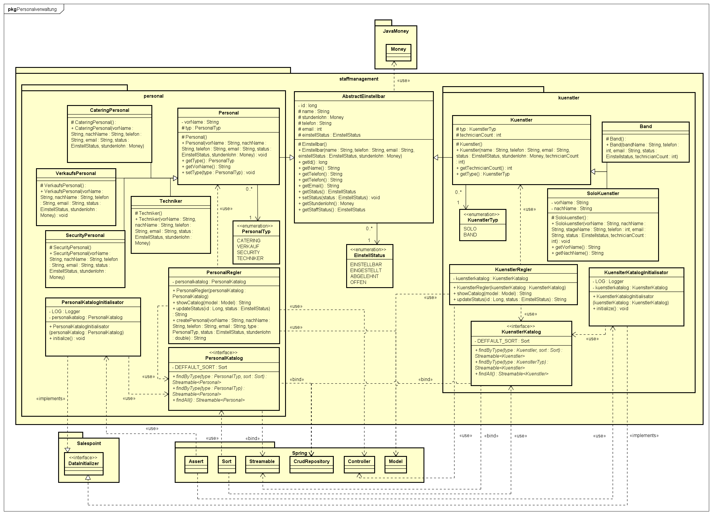
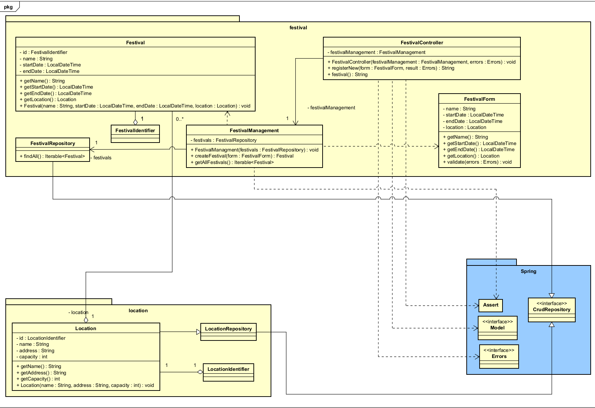
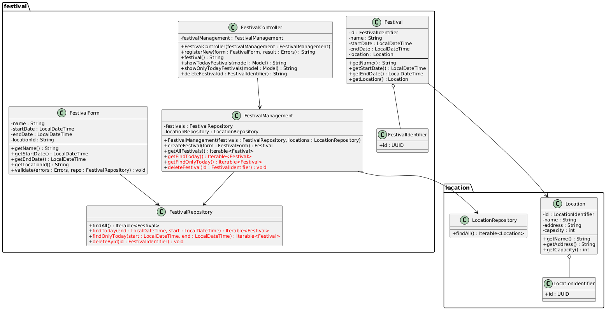
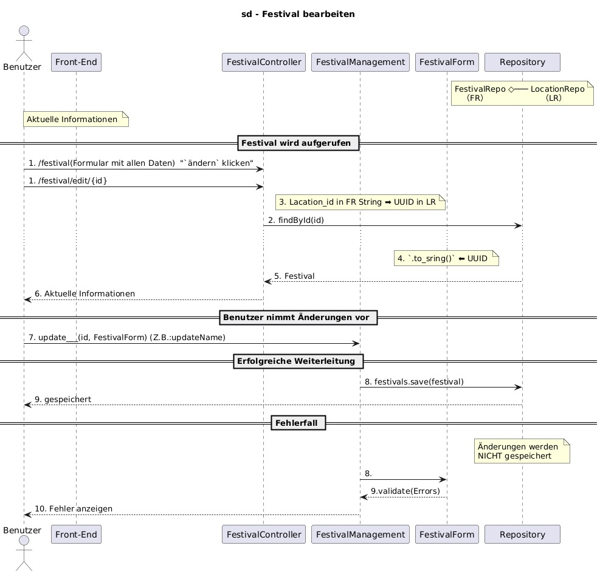
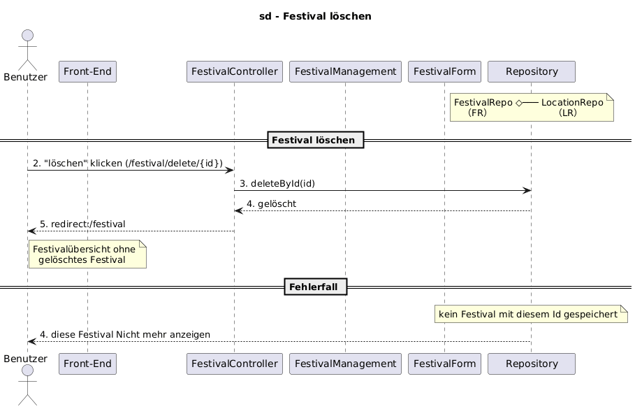

= Entwicklerdokumentation
:project_name: Festivalmanager
:toc: left
:numbered:

[options="header"]
[cols="1, 3, 3"]
|===
|Version | Bearbeitungsdatum   | Autor 
|1.0	|14.11.2025 | Haakon Frank
|1.1 |18.11.2025 |Vanessa Sehring
|===

== Einführung
Mit steigenden Anforderungen an die Organisation von Festivals, wächst auch der Bedarf nach effizienten Verwaltungstools. Der Festivalmanager von FVIV GmbH soll genau dort Veranstaltern helfen, ihre Festivals besser zu planen und zu verwalten.
Unser Festivalmanager ermöglicht es gleichzeitig mehrere Festivals zu verwalten. Ja nach Rolle(z.B. Admin, Veranstalter, Mitarbeiter) können dabei unterschiedliche Funktionen genutzt werden.
Zunächst werden Festivals und deren Location von einem Manager angelegt. Danach werden Personal zugewiesen und Logins erstellt und verteilt. Das Personal lässt sich später noch bearbeiten.
Neben dem Personal wird auch die Lagerverwaltung unterstützt. Lebensmittel können hinzugefügt, bearbeitet und gelöscht werden. Beim Verkauf von Essen und Trinken wird dies automatisch aus dem Lager entfernt. Das selbe gilt für Tickets. Tickets sind bis zu 3 Tage vorab online zu erwerben und danach bei einem Verkaufsmitarbeiter vor Ort. Es gibt 2 Ticketkategorien: Tages- und Festivaltickets.
Zusätzlich können Bereiche geplant und zugewiesen werden. Bereiche sind z.B. Bühnen, Catering oder Parken.
Für die Bühnen ist es möglich Künstler zuzuweisen und einen Spielplan zu erstellen.
Eine zentrale Rolle nimmt der Festivalmanager ein, welcher die Organisation vor Ort übernimmt und bei Problemen automatisch benachrichtigt wird. Für jegliche andere Kommunikation zwischen den Mitarbeitern gibt es ein internes Chatsystem.
Über das Festvalgelände verteilt gibt es Terminals für die Besucher, an denen sie sich über den Lage- und Spielplan informieren können.
Alle Ausgaben und Einnahmen werden in einem aktuellen Dashboard übersichtlich dargestellt.

== Randbedingungen
=== Hardware Specifications

* Server mit Linux (Unternehmen)
* Computer mit internet connection (Endbenutzer)
* Keyboard (Endbenutzer)
* Mouse (Endbenutzer)

=== Software Specifications

Die follgende Java Version (oder neuere) wird benötigt um die Anwendung zu benutzen:

* Java 21

Einer der follgenden Browser Versionen (oder neuere) wird benötigt um die Anwendung zu benutzen:

* Firefox 145.0.0
* Google Chrome 114.0.5735.90

== Kontextabgrenzung
* Kontextdiagramm

image::./models/analysis/System-Context-Diagramm-docu.jpg[context diagram c4, 100%, 100%, pdfwidth=100%, title= "Kontextdiagramm in C4", align=center]

== Lösungsstrategie
=== Erfüllung der Qualitätsziele
[options="header"]
|=== 
| Qualitätsziel              | Lösungsansatz
| Sicherheit               a|
                             * Passwörter mit ausreichender Komplexität
                             * Rollenkonzept, damit nur Nutzer mit der richtigen Authentifizeriung in bestimmte Bereiche der Software dürfen
| Benutzerfreundlichkeit   a|
                             * Berücksichtigung der Universal-Design-Prinzipien
                             * Verwendung von einfacher Sprache, hohe Kontraste
                             * intuitiver Aufbau der Webseite (Benötigte Elemente einer Nutzergruppe sollten hervorgehoben sein bzw. sehr leicht zugänglich mit wenigen Klicks sein.)
                             *
                             * Fehlermeldungen sollten angezeigt werden, um Nutzer ein sicheres Gefühl bei Interaktionen zu vermitteln.
                             * Proband (ohne vorherige Kentnisse über die Software) testet und bewertet seinen Eindruck
| Zuverlässigkeit          a|
                             * Validierung vor hinzufügen von Eingabedaten in die Datenbank, sodass der Datenbestand konsistent bleibt
                             * eine Validierung wird schon vor dem Hinzufügen von Informationen in die Datenbank durchgeführt
| Performance              a|
                             * effiziente Datenbankabfragen, die wenig Zeit und Rechenkapazität in Anspruch nehmen
                             * Reduzierung des Network Traffics mit Hilfe von Komprimierung der statischen Inhalten wie z.B. Bildern
| Wartbarkeit              a|
                             * modularer Code für einfacherere Weiterentwicklung
                             * ausführliche Dokumentation für andere Entwickler, die sich damit auseinandersetzen
|===

=== Softwarearchitektur
* Beschreibung der Architektur anhand der Top-Level-Architektur oder eines Client-Server-Diagramms

[[container_diagram_d_c4]]
image::./models/analysis/Top-Level-Architektur.jpg[top level architecture, 100%, 100%, pdfwidth=100%, title= "Top-Level-Architektur Diagramm des {project_name} in C4", align=center]

=== Entwurfsentscheidungen

[options="header", cols="1,2,3"]
|===
|Externes Package |Verwendet von |Warum
|Spring Boot |Allgemeine Anwendung |Stellt den eingebetteten Webserver, die grundlegende Projektstruktur sowie die automatische Konfiguration bereit und sorgt dafür, dass alle weiteren Spring-Komponenten zusammenarbeiten.
|Spring MVC |Web / Controller |Definiert HTTP-Routen, Controller Aufbau und wie Daten zwischen Backend und HTML-Oberfläche verarbeitet werden.
|Spring Data |Persistenz |Verwaltung der Produktdaten. Das Framework liefert generische Repository-Schnittstellen und implementiert standard CRUD-Operationen.
|Salespoint Inventory |Persistenz |Bestandsverwaltung aller Produkte. Es stellt Mengen- und Reservierungslogik bereit und sorgt dafür, dass Bestände konsistent bleiben.
|Thymeleaf |UI |HTML-Oberflächen dynamisch zu erzeugen. Es ermöglicht die Ausgabe von Variablen, Formularverarbeitung, Schleifen und Bedingungen direkt in den Templates.
|Semantic UI |UI |Sorgt für das visuelle Erscheinungsbild der Weboberfläche. Das Framework stellt fertige Layout- und Komponentenstile bereit.
|===

== Bausteinsicht

=== Kartenansicht
image::./models/analysis/Ticket_Klassendiagramm.jpg[Ticket Klassendiagramm, 100%, 100%, pdfwidth=100%, title= "Ticket Klassendiagramm des Festivalmanagers", align=center]

[options="header"]
|=== 
|Klasse/Enumeration |Description
| Ticket | Die Klasse Ticket erbt von der Salespoint Product Klasse und stellt die Karten dar. Sie ermöglicht das drucken von Karten und stellt eine Funktion zum Anzeigen der aufgearbeiteten Kategorien für das Frontend bereit.
| TicketInitializer | Der TicketInitializer kümmert sich um die Erstellung von Tickets.
| TicketRepository | Bietet eine Schnittstelle zum Umgang mit Ticket-Entitäten aus der Datenbank.
| TicketManagement | Verwaltet Hilfsfunktionen zum Umgang und zur Bearbeitung von Karten.
| TicketController | Der TicketController regelt die Preis- und Bestandsänderungen von Karten, sowie das auslösen des Druckens von Karten.
|===

=== Lageransicht
image::./models/analysis/Lebensmittel Klassendiagramm.jpg[Lebensmittel Klassendiagramm, 100%, 100%, pdfwidth=100%, title= "Lebensmittel Klassendiagramm des Festivalmanagers", align=center]

[options="header"]
|=== 
|Klasse/Enumeration |Description
| Lebensmittel | Die Klasse Lebensmittel erbt von der Salespoint Product Klasse und stellt die Lebensmittel dar.
| LagerController | Der LagerController regelt das hinzufügen und auflisten von Lebensmitteln.
| StorageInitializer | Der StorageInitializer kümmert sich um die Erstellung des Lagers.
| LebensmittelRepository | Bietet eine Schnittstelle zum Umgang mit Lebensmittel-Entitäten aus der Datenbank.
| StorageManagement | Verwaltet Hilfsfunktionen zum Umgang und zur Bearbeitung des Lagers und Lebensmittel darin.
|===

=== Bereichsplanung
image::./models/analysis/Bereichsplanung_Klassendiagramm.jpg[Bereichsplanung Klassendiagramm, 100%, 100%, pdfwidth=100%, title= "Bereichsplanung Klassendiagramm des Festivalmanagers", align=center]

[options="header"]
|=== 
|Klasse/Enumeration |Description
| Bereich | Die Klasse Bereich stellt die Grundfunktionen eines Bereiches dar. Sie implementiert das Salespoint Framework mit Product.
| BereichController |Die KLasse BereichController regelt das Auflisten, löschen und die Initialen Daten, der Lagepläne.
| Bereichrepository | Das Repository erweitert das springframework.crudrepository und ist für die Kommunikation mit der Datenbank da.
| Bereichmanager |  Verbindungsstelle zwischen Repository und Manager.
|BereichInitializer | Erbt von Datainitializer in Salespoint und ist notwendig um die Klasse BereichIntializerManager zu haben.
|BereichIntializerManager | In dieser KLasse werden die verschiedenen auswählbaren bereichspläne gespeichert.
|Buehne | Erbt von Bereich und bietet erweiternde Methoden für den Bereich Buehne.
|Wiese | Erbt von Bereich und bietet erweiternde Methoden für den Bereich Wiese.
|Catering | Erbt von Bereich und bietet erweiternde Methoden für den Bereich Catering.
|Camping | Erbt von Bereich und bietet erweiternde Methoden für den Bereich Camping.
|Toiletten | Erbt von Bereich und bietet erweiternde Methoden für den Bereich Toiletten.
|ErsteHilfeZelt | Erbt von Bereich und bietet erweiternde Methoden für den Bereich ErsteHilfeZelt.
|===

=== Personalplanung

[options="header"]
|=== 
|Klasse/Enumeration |Description
| AbstractEinstellbar                        | Es werden Basisinformationen von dieser Klasse geerbt, die die Einstellbaren später alle präsentieren müssen.
| Einstelstatus                              | Um anzugeben, in welchem Teil des Bewerbungsprozessen/Rückmeldezustand die Person ist.
| Personal                                   | Basis für spätere Angestellten des Festivals, die ihre Aufgabe zu erledigen haben. 
| Catering/Verkauf/Security/Techniker        | Einzelne Ausprägungen des allg. Angestellten, der dann diese eine spezifische Tätigkeit hat.
| Kuenstler                                  | Basis für die Künstler, die man für das Festival hat.
| SoloKuenstler/Band                         | Verschiende Ausprägungen des Kuenstler, hier nur zwei Möglichkeiten.
| PersonalTyp/KuenstlerTyp                   | Wird verwendet, um die Ausprägungen zu deklarieren.
| PersonalRegler/KuenstlerRegler             | Bietet wichtige Methoden, um den Datenbestand der betroffenen Personengruppe abzuändern.
| PersonKatalog/KuenstlerKatalog             | Entscheidet als Schnittstelle, wie man im Datenbestand auf die im Katalog enthaltenen Personen zugreifen kann. 
| Personal-/KuenstlerKatalogInitialisator    | Gibt initiale Informationen in die Datenbank, um eine Liste an einstellbaren Personen anzubieten, von dem man Leute einstellen kann.
|===

=== Festivals und Locations

[options="header"]
|=== 
|Klasse/Enumeration |Description
| Festival                                   | Stellt das Festival dar, mit seinen Eigenschaften wie Name, Datum und Location.
| FestivalController                         | Regelt die Erstellung und Auflistung von Festivals.
| FestivalForm                               | Regelt die Eingabe und validierung von Festivaldaten im Frontend.
| FestivalIdentifier                         | Stellt eine eindeutige Kennung für jedes Festival dar.
| FestivalManagement                         | Verwaltet die Geschäftslogik rund um Festivals, wie z.B. das Erstellen und Speichern von Festivals.
| FestivalRepository                         | Bietet eine Schnittstelle zum Speichern und Abrufen von Festival-Entitäten aus der Datenbank.
| Location                                   | Stellt eine Veranstaltungsort dar, mit Eigenschaften wie Name, Addresse und Kapazität.
| LocationIdentifier                         | Stellt eine eindeutige Kennung für jeden Veranstaltungsort dar.
| LocationRepository                         | Bietet eine Schnittstelle zum Speichern und Abrufen von Location-Entitäten aus der Datenbank.
|===

=== Rückverfolgbarkeit zwischen Analyse- und Entwurfsmodell
_Die folgende Tabelle zeigt die Rückverfolgbarkeit zwischen Entwurfs- und Analysemodell._

[options="header"]
|===
|Klasse/Enumeration (Analysemodell) |Klasse/Enumeration (Entwurfsmodell)
| Ticket | kickstart.welcome.Ticket
| Lebensmittel | kickstart.welcome.Lebensmittel
| Inventory | salespointframework.UniqueInventory
| InventoryItem | salespointframework.UniqueInventoryItem

| Bereich | kickstart.bereichsplanung.Bereich
| BereichManager | kickstart.bereichsplanung.BereichManager
| BereichController | kickstart.bereichsplanung.BereichController
| BereichRepository | kickstart.bereichsplanung.BereichRepository
| BereichInitializer | kickstart.bereichsplanung.BereichInitializer
| BereichInitializerManager | kickstart.bereichsplanung.BereichInitializerManager
| Buehne | kickstart.bereichsplanung.Buehne
| Wiese | kickstart.bereichsplanung.Wiese
| Toilette | kickstart.bereichsplanung.Toilette
| Camping | kickstart.bereichsplanung.Camping
| Catering | kickstart.bereichsplanung.Catering
| ErsteHIlfeZelt | kickstart.bereichsplanung.ErsteHilfeZelt

| EinstellStatus          |  staffmanagement.EinstellStatus
| AbstractEinstellbar     |  staffmanagement.AbstractEinstellbar
| Personal                |  staffmanagement.personal.Personal
| PersonalTyp             |  staffmanagement.personal.PersonalTyp
| Kuenstler               |  staffmanagement.kuenstler.Kuenstler
| KuenstlerTyp            |  staffmanagement.kuenstler.KuenstlerTyp
| CateringPersonal        |  staffmanagement.personal.CateringPersonal
| VerkaufsPersonal        |  staffmanagement.personal.VerkaufsPersonal
| SecurityPersonal        |  staffmanagement.personal.SecurityPersonal
| Techniker               |  staffmanagement.personal.Technician
| SoloKuenstler           |  staffmanagement.kuenstler.SoloKuenstler
| Band                    |  staffmanagement.kuenstler.Band

| Festival                |  java.festival.Festival
| FestivalController      |  java.festival.FestivalController
| FestivalIdentifier      |  java.festival.FestivalIdentifier
| FestivalManagement      |  java.festival.FestivalManagement
| FestivalRepository      |  java.festival.FestivalRepository
| FestivalForm            |  java.festival.FestivalForm
| Location                |  java.location.Location
| LocationIdentifier      |  java.location.LocationIdentifier
| LocationRepository      |  java.location.LocationRepository
|===

== Laufzeitsicht
* Darstellung der Komponenteninteraktion anhand eines Sequenzdiagramms, welches die relevantesten Interaktionen darstellt.

