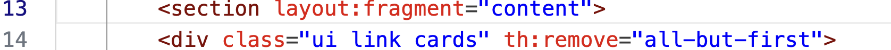

## <u>Videoshop</u> Änderung

### `Catalog.html`

Füge **vor dem bestehenden Inhalt** des `section`-Bereichs eine **Such-/Filterleiste** ein.



Neu eingefügter Code:

### `Catalog.html`

```html
    <!-- search -->
            <form action="/filter" method="get"
                hx-get="/filter"
                hx-target="#catalogList"
                hx-push-url="true">
                <h4>Preis</h4>
                <div class="price-inputs">
                    <input type="number" name="minPrice" min="0" step="1"
                        placeholder="min"
                        th:value="${minPrice}">
                    <span> — </span>
                    <input type="number" name="maxPrice" min="0" step="1"
                        placeholder="max"
                        th:value="${maxPrice}">
                </div>


                <h4>Typ</h4>
                <div name="type" class="genre-checkbox-group">
                <label><input type="checkbox" name="type" value="Action" th:checked="${type != null and type.contains('Action')}"> Action</label>
                <label><input type="checkbox" name="type" value="Adventure" th:checked="${type != null and type.contains('Adventure')}"> Adventure</label> 
                <label><input type="checkbox" name="type" value="Animation" th:checked="${type != null and type.contains('Animation')}"> Animation</label>
                <label><input type="checkbox" name="type" value="Biography" th:checked="${type != null and type.contains('Biography')}"> Biography</label><br>
                <label><input type="checkbox" name="type" value="Comedy" th:checked="${type != null and type.contains('Comedy')}"> Comedy</label>
                <label><input type="checkbox" name="type" value="Crime" th:checked="${type != null and type.contains('Crime')}"> Crime</label>
                <label><input type="checkbox" name="type" value="Drama" th:checked="${type != null and type.contains('Drama')}"> Drama</label>
                <label><input type="checkbox" name="type" value="Family" th:checked="${type != null and type.contains('Family')}"> Family</label><br>
                <label><input type="checkbox" name="type" value="Horror" th:checked="${type != null and type.contains('Horror')}"> Horror</label>
                <label><input type="checkbox" name="type" value="Martial Arts" th:checked="${type != null and type.contains('Martial Arts')}"> Martial Arts</label>
                <label><input type="checkbox" name="type" value="Political Drama" th:checked="${type != null and type.contains('Political Drama')}"> Political Drama</label>
                <label><input type="checkbox" name="type" value="Sci-Fi" th:checked="${type != null and type.contains('Sci-Fi')}"> Sci-Fi</label><br>
                <label><input type="checkbox" name="type" value="Thriller" th:checked="${type != null and type.contains('Thriller')}"> Thriller</label>
                <label><input type="checkbox" name="type" value="War" th:checked="${type != null and type.contains('War')}"> War</label>
                </div>

                <h4>Name</h4>
                <input type="text" name="name" placeholder="z.B. Last Action Hero"
                        th:value="${name}">
                
                <br><br>
                <button type="submit">Anwenden</button>
            </form>

            <br><br>
```


### `CatalogController.java`

```java
import java.util.List; //neu Zeile 21
//……

//neu Zeile 76
	@GetMapping("/filter")
	String filterCatalog(
			@RequestParam(required = false) String name,
			@RequestParam(required = false) List<String> type,
			@RequestParam(required = false) Integer minPrice,
			@RequestParam(required = false) Integer maxPrice,
			Model model
	) {

		// 1. DVD + BLURAY
		Iterable<Disc> allDiscs = catalog.findAll();

		// 2. Filterung durchführen
		List<Disc> filtered = new ArrayList<>();

		for (Disc d : allDiscs) {

			// a) Name
			if (name != null && !name.isBlank()) {
				String lowerName = name.toLowerCase();
				if (!d.getName().toLowerCase().contains(lowerName)) {
					continue;
				}
			}

			// b) Genre 
			if (type != null && !type.isEmpty()) {
				boolean matchAny = false;
				for (String t : type) {
					if (d.getGenre() != null && d.getGenre().contains(t)) {
						matchAny = true;
						break;
					}
				}
				if (!matchAny) {
					continue;
				}
			}

			// c)Preisbereich
			double priceValue = d.getPrice().getNumber().doubleValue(); 
			if (minPrice != null) {
				if (priceValue < minPrice) {
					continue;
				}
			}
			if (maxPrice != null) {
				if (priceValue > maxPrice) {
					continue;
				}
			}
			filtered.add(d);
		}

		// 3. Gefilterte Ergebnisse an `catalog.html`
		model.addAttribute("catalog", filtered);
		model.addAttribute("title", "catalog.search.title");
		model.addAttribute("name", name);
		model.addAttribute("type", type);
		model.addAttribute("minPrice", minPrice);
		model.addAttribute("maxPrice", maxPrice);

		return "catalog";
	}

```

